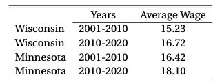

```{r setup, include=FALSE}
knitr::opts_chunk$set(echo = TRUE)

library(tidyverse)
library(knitr)
```

### 18.2

In regression (18.1) with $T = 2$ and $N = 2$ suppose the time variable is omitted. Thus the estimating equation is $Y_{it} = \beta_0+\beta_1State_i + \theta D_{it} + \varepsilon_{it}$. where $D_{it} =State_i Time_t$ is the treatment indicator.

(a) Find an algebraic expression for the least squares estimator $\hat{\theta}$.

We can rewrite the estimating equation as

$$
Y_{it} = \beta_0+\beta_1State_i + \theta D_{it} + \varepsilon_{it} \implies Y_{it}-\beta_1State_i = \beta_0 + \theta D_{it} + \varepsilon_{it}
$$

Thus, the regression becomes a simple OLS regression of $Z_{it} := Y_{it}-\beta_1State_i$ on $D_{it}$:

\begin{align*}
\hat{\theta} 
&= \frac{\sum_{t=1}^T \sum_{i=1}^n (D_{it} - \bar{D}_i) (Z_{it} - \bar{Z}_i)}
{\sum_{t=1}^T \sum_{i=1}^n (D_{it} - \bar{D}_i)^2}\\
&= \frac{\sum_{t=1}^T \sum_{i=1}^n (D_{it} - \bar{D}_i) ((Y_{it}-\beta_1State_i) - (\bar{Y}_i-\beta_1State_i))}
{\sum_{t=1}^T \sum_{i=1}^n (D_{it} - \bar{D}_i)^2}\\
&= \frac{\sum_{t=1}^T \sum_{i=1}^n (D_{it} - \bar{D}_i) (Y_{it} - \bar{Y}_i)}
{\sum_{t=1}^T \sum_{i=1}^n (D_{it} - \bar{D}_i)^2}
\end{align*}

where $\bar{D}_i = \frac{1}{T} \sum_{t=1}^{T} D_{it}$, $\bar{Y}_i = \frac{1}{T} \sum_{t=1}^{T} Y_{it}$, and $\bar{Z}_i = \frac{1}{T} \sum_{t=1}^{T} Z_{it}$ for all $t$.

(b) Show that $\hat{\theta}$ is a function only of the treated sub-sample and is not a function of the untreated sub-sample.

Notice that for the untreated sub-sample: $D_{it} = 0$ for all $t \implies \bar{D}_i = 0$, thus all elements in $\hat{\theta}$ from untreated are multipled by zero, thus $\hat{\theta}$ is a function only of the treated sub-sample:

$$
\hat{\theta} 
= \frac{\sum_{t=1}^T \sum_{i=1}^n (D_{it} - \bar{D}_i) (Y_{it} - \bar{Y}_i)}
{\sum_{t=1}^T \sum_{i=1}^n (D_{it} - \bar{D}_i)^2}
= \frac{\sum_{t=1}^T(D_{1t} - \bar{D}_1) (Y_{1t} - \bar{Y}_1)}
{\sum_{t=1}^T (D_{1t} - \bar{D}_1)^2}
$$

(c) Is $\hat{\theta}$ a difference-in-difference estimator?

No, by part (b), it just estimates the difference for the treated group.  It confounds policy and time effects.

(d) Under which assumptions might $\hat{\theta}$ be an appropriate estimator of the treatment effect?

If we assume no time effects (trend or aggregate changes), then the outcome variable for the untreated group would be constant, so the difference estimator and the difference-in-difference estimator would be identical.

\pagebreak

### 18.4

For the specification tests of Section 18.4 explain why the regression test for homogeneous treatment effects includes only $N_2 - 1$ interaction dummy variables rather than all $N_2$ interaction dummies. Also explain why the regression test for equal control effects includes only $N_1 - 1$ interaction dummy variables rather than all $N_1$ interaction dummies.

If all $N_1$ interaction dummies are included, then the column of $X$ are perfectly collinear and then $X'X$ would not be invertible. For dummy variable regressions, one group needs to be the base group to which coefficient estimate are relative.

### 18.5

An economist is interested in the impact of Wisconsin’s 2011 “Act10” legislation on wages. (For background, Act 10 reduced the power of labor unions.) She computes the following statistics for average wage rates in Wisconsin and the neighboring state of Minnesota for the decades before and after Act 10 was enacted. 

```{r facilities1, echo = FALSE, out.width = 200}

```

(a) Based on this information, what is her point estimate of the impact of Act 10 on average wages?

The difference between the Wisconsin observations is the change in wages due to time and due to the policy:

$$
\Delta_p + \Delta_t = 16.72 - 15.23 = 1.49
$$

The difference between the Minnesota observations is the change in wages due to time:

$$
\Delta_t = 18.10 - 16.42 = 1.68
$$

Thus, the change due to the policy is:

$$
\Delta_p = (\Delta_p + \Delta_t ) - \Delta_t = 1.49 - 1.68 = -0.19
$$

(b) The numbers in the above table were calculated as county-level averages. (The economist was given the average wage in each county. She calculated the average for the state by taking the average across the counties.) Now suppose that she estimates the following linear regression, treating individual counties as observations: $wage = \alpha + \beta Act10 + \gamma Wisconsin + \delta Post2010 + e$ The three regressors are dummy variables for “Act 10 in effect in the state”, “county is in Wisconsin”, and “time period is 2011-2020.” What value of $\hat{\beta}$ does she find?

$Act10$ represents the variable of interest in a difference-in-difference estimation, so it equals one for only Wisconsin 2010-2020. Thus, it equals the point estimate from (a), so $\hat{\beta} = -0.19$.

(c) What value of $\hat{\gamma}$ does she find?

$\hat{\gamma}$ will capture the "before" difference between average wages in Wisconsin counties and Minnesota counties:

$$
\hat{\gamma} = 15.23 - 16.42 = -1.19
$$ 

\pagebreak

### 17.1

If $X^*$ is a random variable with density $\hat{f}(x)$ from (17.2), show that

(a) $E[X^*] = \bar{X}_n$.

Define $y := \frac{X_i - x}{h} \implies x = X_i - hy$ and $dy = \frac{dx}{h}$,

\begin{align*}
E[X^*] 
&= \int x \hat{f}(x) dx \\
&= \int x \frac{1}{nh} \sum_{i=1}^n K\Bigg(\frac{X_i - x}{h}\Bigg) dx\\
&= \frac{1}{nh}  \sum_{i=1}^n \int x K\Bigg(\frac{X_i - x}{h}\Bigg) dx \\
&= \frac{1}{n}  \sum_{i=1}^n \int (X_i - hy) K(y) dy \\
&= \frac{1}{n}  \sum_{i=1}^n X_i  \int K(y) dy - \frac{h}{n}  \sum_{i=1}^n \int y K(y) dy \\
&= \frac{1}{n}  \sum_{i=1}^n X_i  - \frac{h}{n}  \sum_{i=1}^n (0) \\
&= \bar{X}_n  
\end{align*}

Because $\int K(y) dy = 1$ and $\int y K(y) dy = 0$.

(b) $var[X^*] = \hat{\sigma}^2 + h^2$.

\begin{align*}
var[X^*] 
&= E[(X^*)^2] - E[X^*]^2 \\
&= \int x^2 \frac{1}{nh} \sum_{i=1}^n K\Bigg(\frac{X_i - x}{h}\Bigg) dx - \bar{X}_n ^2 \\
&= \int (X_i - hy)^2 \frac{1}{n} \sum_{i=1}^n K(y) dy - \bar{X}_n ^2 \\
&= \int (X_i^2  - 2 X_i hy + h^2y^2) \frac{1}{n} \sum_{i=1}^n K(y) dy - \bar{X}_n ^2 \\
&= \frac{1}{n} \sum_{i=1}^n X_i^2  \int K(y) dy  - 2h \frac{1}{n} \sum_{i=1}^n X_i\int y K(y) dy + \frac{1}{n} h^2 \sum_{i=1}^n \int y^2  K(y) dy  - \bar{X}_n ^2 \\
&= \frac{1}{n} \sum_{i=1}^n X_i^2+  h^2  - \bar{X}_n ^2 \\
&= \hat{\sigma}^2 + h^2
\end{align*}

Because $\int y^2 K(y) dy = 1$ for normalized kernel functions.

\pagebreak

### 17.3

Suppose $f(x)$ is the uniform density on $[0, 1]$. What does (17.11) suggest should be the optimal bandwidth $h$? How do you interpret this?

Equation (17.11) is

$$
h_0 = \Bigg(\frac{R_k}{R(f'')}\Bigg)^{1/5} n^{-1/5}
$$

Where

$$
R(f'') = \int_{-\infty}^\infty (f''(x))^2 dx
$$

For a uniform density on $[0, 1]$, $f(x) = 1 \implies f'(x) = f''(x) = 0$.  Thus, the optimal bandwidth is infinite.  We should interpret this that we should choose as a high a bandwidth as possible.  This makes sense that the optimal bandwidth for a uniform distribution is very large.  Maybe we should use a different technique to estimate the distribution.

### 17.4

You estimate a density for expenditures measured in dollars, and then re-estimate measuring in millions of dollars, but use the same bandwidth $h$. How do you expect the density plot to change? What bandwidth should use so that the density plots have the same shape?

With the data divided by one million and the bandwidth left unchanged, we would expect the density plot to be much smoother than it was initially.  If the bandwidth should be rescaled (divided by 1 million) by the same factor for the density plot to have the same shape.

### 19.3

Describe in words how the bias of the local linear estimator changes over regions of convexity and concavity in $m(x)$. Does this make intuitive sense?

The asymptotic bias of the local linear estimator is $\frac{1}{2}m''(x)$ (Hanson p. 675). 

- If $m(x)$ is convex over a region $\implies m''(x) > 0 \implies$ the local linear estimator is biased upward (positive).
- If $m(x)$ is concave over a region $\implies m''(x) < 0 \implies$ the local linear estimator is biased downward (negative).

Yes, this relationship intuitively makes following from Jenson's inequality.

\pagebreak

### 19.4

Suppose the true regression function is linear $m(x) = \alpha + \beta x$ and we estimate the function using the Nadaraya-Watson estimator. Calculate the bias function $B(x)$. Suppose $\beta > 0$. For which regions is $B(x) > 0$ and for which regions is $B(x) < 0$? Now suppose that $\beta < 0$ and re-answer the question. Can you intuitively explain why the NW estimator is positively and negatively biased for these regions?

Let $f(x)$ be the marginal density of $X \implies f(x) > 0$ and $f'(x) > 0$ if $X$ is becoming more likely as $X$ increases.  Since the true regression function is linear:

$$
m(x) = \alpha + \beta x \implies m'(x) = \beta \implies m''(x) = 0
$$

By Theorem 19.1 (Hanson p. 675),

$$
B(x) = \frac{1}{2} (0) + \frac{f'(x) (\beta)}{f(x)} = \frac{\beta f'(x) }{f(x)}
$$

Say $\beta > 0$. Then $B(x) > 0$, if $X$ is becoming more likely as $X$ increases ($f'(x) > 0$) and $B(x) < 0$, if $X$ is becoming less likely as $X$ increases ($f'(x) < 0$).  If $f'(x) > 0$, then $X$ is becoming more likely as $X$ decreases, so the NW estimate is bias downward because it's an average with more weight on high values.

Say $\beta < 0$. Then $B(x) > 0$, if $X$ is becoming less likely as $X$ increases ($f'(x) < 0$) and $B(x) < 0$, if $X$ is becoming more likely as $X$ increases ($f'(x) > 0$).

\pagebreak

### 19.9

Take the `Invest1993` dataset and the subsample of observations with $Q \le 5$. (In the dataset $Q$ is the variable `vala`.)

(a) Use Nadaraya-Watson to estimate the regression of $I$ on $Q$. (In the dataset $I$ is the variable `inva`.) Plot with 95% confidence intervals.

```{r problem199a}
library(npregfast)

df <- read_delim("Invest1993.txt", delim = "\t", col_types = cols())

subsample <- df %>% filter(vala <= 5)

nw <- frfast(inva ~ vala, data = subsample, p = 0)

plot(x = nw$x, y = nw$p[,1,1],  col = "red", type = "l", ylim = c(0.07, .16),
     xlab = "Q", ylab = "I")
lines(x = nw$x, y = nw$pu[,1,1],  col = "red", lty=2)
lines(x = nw$x, y = nw$pl[,1,1],  col = "red", lty=2)

# Cross validation is used to obtain the bandwidth.
print(nw$h0)
```

\pagebreak

(b) Repeat using the Local Linear estimator.

```{r problem199b}
lle <- frfast(inva ~ vala, data = subsample, p = 1)

plot(x = nw$x, y = nw$p[,1,1],  col = "red", type = "l", ylim = c(0.05, 0.2), 
     xlab = "Q", ylab = "I")
lines(x = nw$x, y = nw$pu[,1,1],  col = "red", lty=2)
lines(x = nw$x, y = nw$pl[,1,1],  col = "red", lty=2)

lines(x = lle$x, y = lle$p[,1,1],  col = "blue")
lines(x = lle$x, y = lle$pu[,1,1],  col = "blue", lty=2)
lines(x = lle$x, y = lle$pl[,1,1],  col = "blue", lty=2)
```

(c) Is there evidence to suggest that the regression function is nonlinear?

Yes, the regression lines in parts (a) and (b) appear nonlinear.

\pagebreak

### 19.11

We will consider a nonlinear AR(1) model for gdp growth rates

$$
Y_t = m(Y_{t-1})+e_t 
$$
$$
Y_t = 100 \Bigg( \Bigg(\frac{GDP_t}{GDP_{t-1}}\Bigg)^4 - 1 \Bigg)
$$

(a) Create GDP growth rates $Y_t$. Extract the level of real U.S. GDP (`gdpc1`) from the `FRED-QD` dataset and make the above transformation to growth rates.

```{r problem_1911a}
library(readxl)

df <- read_xlsx(path = "FRED-QD.xlsx") %>% 
  select(time, gdpc1) %>%
  mutate(y  = 100 * ((gdpc1/lag(gdpc1))^4 - 1),
         y_lag = lag(y))
```

(b) Use Nadaraya-Watson to estimate $m(x)$. Plot with 95% confidence intervals.

```{r problem_1911b}
nw <- frfast(y ~ y_lag, data = df, p = 0)

plot(x = nw$x, y = nw$p[,1,1],  col = "red", type = "l",
     xlab = "y_{t-1}", ylab = "y_t", ylim = c(-2, 6))
lines(x = nw$x, y = nw$pu[,1,1],  col = "red", lty=2)
lines(x = nw$x, y = nw$pl[,1,1],  col = "red", lty=2)

# Cross validation is used to obtain the bandwidth.
print(nw$h0)
```

\pagebreak

(c) Repeat using the Local Linear estimator.

```{r problem_1911c}
lle <- frfast(y ~ y_lag, data = df, p = 1)

plot(x = lle$x, y = lle$p[,1,1],  col = "blue", type = "l",
     xlab = "y_{t-1}", ylab = "y_t", ylim = c(-4, 8))

lines(x = lle$x, y = lle$pu[,1,1],  col = "blue", lty=2)
lines(x = lle$x, y = lle$pl[,1,1],  col = "blue", lty=2)
```

(d) Do you see evidence of nonlinearity?

Yes, the plots show nonlinear regressions.  Although the regression lines are more-or-less linear for a large portion of the domain, there's nonlinearity starting around $y_{t-1} = 10$.  The nonlinearity on the left side of the NW regression appears to be due to boundary bias as it disappears with LLE.
