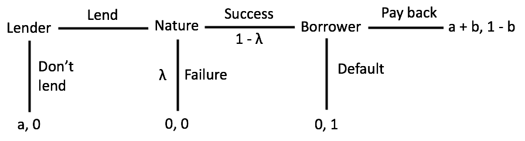

```{r setup, include=FALSE}
knitr::opts_chunk$set(echo = TRUE)

library(tidyverse)
```


1. Two siblings Rowena and Colin are fighting over a piece of cake. Their parents come up with the following procedure to divide the cake. Rowena divides the cake into two pieces, and then Colin chooses one of the two pieces: Rowena obtains the remaining piece. The cake is continuously divisible, and each sibling likes all parts of it equally. Suppose that the cake is perfectly homogeneous, so that each player cares only about the size of the piece of cake he/she obtains. What is the subgame perfect equilibrium?

We solve using backward induction by first considering Colin's move and then Rowena.  Let $x \in [0, 1]$ be the size of one of the pieces of cake and $1 - x$ be the size of the other piece of cake.  Colin chooses $\max\{x, 1 - x\}$.  If Colin chooses $\max\{x, 1 - x\}$, then Rowena will get $\min\{x, 1 - x\}$.  Thus, Rowena's payoff is maximized if she divides the cake into two equal sized pieces $x = 1/2$.

2. Consider the following (noisy) trust game between a borrower and a lender. The lender can choose between trusting or not trusting the borrower. The project is taken up if and only if the lender trusts the borrower. If the lender does not trust the borrower then the lender keeps his investment $a$ (so the lender gets a payoff of $a$ in this case) and the borrower gets zero payoff. If the project is taken up, it fails with a probability $\lambda$, in which case the borrower involuntarily defaults and gets zero payoff whereas the lender loses his investment $a$. If the project is a success (which happens with probability $1 - \lambda$), then the borrower will be able to reciprocate the trust of the lender. The success of the project is private information of the borrower. After the success of the project, if the borrower chooses to repay back then the lender gets his investment a back plus an additional payoff of $b$ and the borrower gets $1 - b$. However, if the borrower chooses to strategically default, then the lender looses his investment $a$ and the borrower gets a payoff of 1. Assume that $0 < a < (1 - \lambda)b < 1 - \lambda$ and that both the lender and borrower are risk neutral. Represent the above strategic situation as an extensive form game and find its subgame perfect Nash equilibrium.

```{r 2, echo=FALSE, fig.cap="Extensive Form Game Tree", out.width = '100%'}

```

First off, let us note that the fact that the success or failure of the project being private information to the borrower does not matter because the lender has no more decision nodes after that has been realized.  Thus, the borrower decision to default or pay back is a subgame.  In this subgame, the borrower will choose to default because $1 > 1 - b$.  Knowing that the borrow will default and the lender will receive zero whether or not the project is successful, the lender will choose to not lend.  Thus, the subgame perfect Nash equilibrium is (Don't lend, Default).

3. Alice and Bob owe \$1 which they can use only after they divide it. Each player’s utility of getting \$$x$ dollar at time t is $\delta^tx$ for $\delta \in (0, 1)$. Consider the following $n$-period symmetric, random bargaining game between Alice and Bob. At any date $t \in \{0, 1, . . . , n - 1\}$, we toss a fair coin; if it comes Head, we select Alice; if it comes Tail, we select Bob. The selected player makes an offer $(x, y) \in [0, 1]^2$ such that $x + y \le 1$. Knowing what has been offered, the other player accepts or rejects the offer. If the offer $(x, y)$ is accepted, the game ends, yielding payoff vector $(\delta^t x, \delta^t y)$ where $\delta^t x$ is the payoff of Alice and $\delta^t y$ is the payoff of Bob. If the offer is rejected, we proceed to the next date, when the same procedure is repeated, except for $t = n - 1$, after which the game ends, yielding (0, 0). Everything described up to here is common knowledge.

(a) Compute the subgame perfect equilibrium for $n = 1$. What is the value of playing this game for a player? (That is, compute the expected utility of each player before the coin-toss, given that they will play the subgameperfect equilibrium.)

The player who wins the coin toss decides how to split the dollar.  The outside option for the other player is zero, so the offering player should take the whole dollar and offer the other player nothing because they are weakly better off accepting.  Each player has an one-half probability of winning the coin toss, so their expected utility is $(1/2)(1) + (1/2)(0) = 1/2$.

(b) Compute the subgame perfect equilibrium for $n = 2$. Compute the expected utility of each player before the first coin-toss, given that they will play the subgame-perfect equilibrium.

Consider the second round of this game.  As we found in part (a), both players have expected utility of 1/2 from this round.  In the first round they discount their expected in the last round, so they both have expected discounted utility of $\delta/2$.  Thus, the winner of coin toss in the first round should offer $\delta/2$ to the other player and leaving $1 - \delta/2$ for themselves. With this offer, the player is indifferent between rejecting and going on to the second round and accepting.  Both players has a one-half probability of winning the coin toss, so their expected utility is $(1/2)(1-\delta/2) + (1/2)(\delta/2) = 1/2$.

(c) What is the subgame perfect equilibrium for $n \ge 3$?

Similar to the second round, the player who lost the coin toss in any round $n \ge 3$ has an expected utility of 1/2 from rejecting and continuing onto the next round.  Thus, the offering player should offer $\delta/2$ to the other player, leaving $1-\delta/2$ for themselves.  The other player should accept because they are weakly better off accepting.

\pagebreak

4. A unit mass of coffee lovers are uniformly located on a street, denoted by the $[0, 1]$ interval. There are two coffee shops, namely coffee shop 1 and coffee shop 2. First, each coffee shop $i \in \{1, 2\}$ selects location $x_i \in [0, 1]$ simultaneously. Then, observing $(x_1, x_2)$, each coffee shop $i \in \{1, 2\}$ sets a price $p_i \ge 0$ for its own coffee, simultaneously. A coffee lover located in $w$ is to pay cost $c(w - y)^2$ to go to a shop located at $y$, where $c > 0$. Given the locations $x_1$ and $x_2$ and prices $p_1$ and $p_2$, each coffee lover buys coffee from the shop with the lowest total cost, which is the sum of the price and the cost to go to the shop. (If the total cost is the same, she flips a coin to choose the shop to buy.) Compute the  subgame-perfect Nash equilibria in the above game.

We use backward induction.  Given $x_i$ and $x_j$ and $p_i$ and $p_j$, consumers buy their coffee from coffee shop $i$ if

\begin{align*}
c(w - x_i)^2 + p_i &< c(w - x_j)^2 + p_j \\
c(w^2 - 2x_iw +x_i^2) + p_i &< c(w^2 - 2x_jw +x_j^2) + p_j \\
cw^2 - 2cx_iw + cx_i^2 + p_i &< cw^2 - 2cx_jw + cx_j^2 + p_j \\
w &<  \frac{c(x_j^2-x_i^2) + p_j - p_i}{2c(x_j- x_i)}
\end{align*}

Because $w$ is uniformly distributed on $[0, 1]$.  Thus, given $x_i$, $x_j$, $p_i$, and $p_j$, total revenue for coffee shop $i$ is

\begin{align*}
p_i \int_0^1 1\{ w  <  \frac{c(x_j^2-x_i^2) + p_j - p_i}{2c(x_j- x_i)}\} dw
&= p_i \int_0^{\frac{c(x_j^2-x_i^2) + p_j - p_i}{2c(x_j- x_i)}} dw \\
&= p_i \frac{c(x_j^2-x_i^2) + p_j - p_i}{2c(x_j- x_i)} 
\end{align*}

FOC [$p_i$]:

\begin{align*}
0 &= \frac{c(x_j^2-x_i^2) + p_j - 2p_i^*}{2c(x_j- x_i)} \\
0 &= c(x_j^2-x_i^2) + p_j - 2p_i^*
\end{align*}

Guess that the subgame nash equilibrium is symmetric ($p_j = p_i^*$):

\begin{align*}
0 &= c(x_j^2 - x_i^2) - p_i^* \\
p_i^* &= c(x_j^2 - x_i^2)
\end{align*}

With both coffee shops selling coffee at the equilibrium price, coffee shop $i$ sells to this quantity of consumers:

$$
\frac{c(x_j^2-x_i^2) + c(x_i^2 - x_j^2) - c(x_j^2 - x_i^2)}{2c(x_j- x_i)}  
= \frac{x_i^2 - x_j^2}{2(x_j- x_i)} 
= \frac{(x_i - x_j)(x_i + x_j)}{2(x_j- x_i)}
= \frac{(-1)(x_i - x_j)(x_i + x_j)}{2(x_i- x_j)}
= \frac{-(x_i + x_j)}{2}
$$

Now, consider coffee shop $i$'s location choice.  Given $x_i$ and $x_j$, the total revenue for coffee shop $i$ is

$$
c(x_j^2 - x_i^2)\frac{(x_i^2 - x_j^2)}{2(x_j- x_i)}
$$
