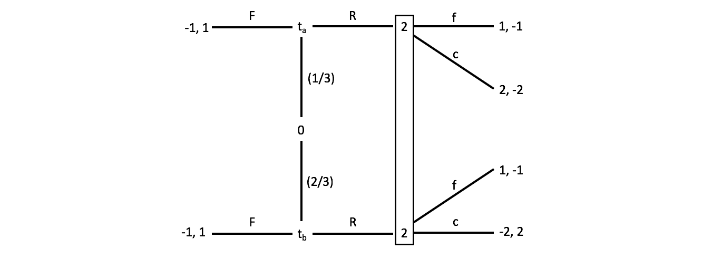

```{r setup, include=FALSE}
knitr::opts_chunk$set(echo = TRUE)

library(tidyverse)
```

1. Consider an infinite repetition of the normal form game below, in which both players discount the future at rate $\delta \in (0, 1)$. For what values of $\delta$ can the play path $\{(C, C),(C, C), ...\}$ be supported in a subgame perfect equilibrium?

```{r 1, echo=FALSE, out.width = '100%'}
knitr::include_graphics("ps6_vonhafften_q1.png")
```

Consider the one-shot deviation principle.  The payoff from both playing $C$ for eternality:

$$
(1 - \delta)\Bigg(2 \sum_{t=0}^\infty \delta^t\Bigg) = 2
$$

The payoff from deviating one-period and playing the one-period Nash equilibrium $(D, D)$ for eternality:

$$
(1 - \delta)\Bigg(8 + \Bigg(1 \sum_{t=1}^\infty \delta^t\Bigg)\Bigg) \\
= (1 - \delta)\Bigg(8 + \delta\Bigg(1 \sum_{t=0}^\infty \delta^t\Bigg)\Bigg) \\
= (1-\delta) 8 + \delta
$$

Find the $\delta$ where the payoff from following the strategy for eternality is higher than the one-period deviation:

$$
\implies 
2 \ge (1-\delta) 8 + \delta
2 \ge 8 - 7 \delta
\implies
\delta \ge \frac{6}{7}
$$

\pagebreak

2. Consider an infinite repetition of the following two-player normal form game.  Consider the following repeated game strategy profile $\sigma$: 

(I) Play (C,C) initially, or if (C,C) was played last period; 
(II) If there is a deviation from (I), play (P,P) once and then restart (I); 
(III) If there is a deviation from (II), then restart (II).

```{r 2, echo=FALSE, out.width = '100%'}
knitr::include_graphics("ps6_vonhafften_q2.png")
```

(a) For what values of $\delta$ is strategy profile $\sigma = (\sigma_1, \sigma_2)$ a subgame perfect equilibrium?

We first consider the values of $\delta$ that preclude profitable deviations from the equilibrium path: $(C, C), ..., (C, C), (D, C), (P, P), (C, C),...$.

\begin{align*}
(1-\delta) 2 \sum_{t=0}^\infty \delta^t &\ge (1-\delta)[3 + \delta (0) + 2\sum_{t=2}^\infty \delta^t] \\
\implies 2 &\ge 3(1-\delta) + 2\delta^2 \\
\implies 0 &\ge 1-3\delta + 2\delta^2 \\
\implies \delta &\ge 1/2
\end{align*}

Now we consider the values of $\delta$ that preclude profitable deviations from the punishment path: $(C, C), ...., (C, C), (D, C), (D, P), (P, P),(C, C), ...$.

\begin{align*}
(1-\delta)[0 + 2 \sum_{t=1}^\infty \delta^t] &\ge (1-\delta)[1 + \delta(0) + 2\sum_{t=2}^\infty \delta^t]\\
\implies 2 \delta &\ge 1-\delta + 2 \delta^2\\
\implies 0 &\ge 1-3\delta + 2 \delta^2\\
\implies \delta &\ge 1/2
\end{align*}

Thus, $\sigma$ is a subgame perfect nash equilibrium for $\delta \in [1/2, 1]$.

(b) Suppose that in the stage game, action profile $(P, P)$ results in both players receiving a payoff of 1/2 rather than a payoff of 0. In this case, what are the values of $\delta$ for which strategy profile $\sigma = (\sigma_1, \sigma_2)$ is a subgame perfect equilibrium?

We first consider the values of $\delta$ that preclude profitable deviations from the equilibrium path: $(C, C), ..., (C, C), (D, C), (P, P), (C, C),...$.

\begin{align*}
(1-\delta) 2 \sum_{t=0}^\infty \delta^t &\ge (1-\delta)[3 + \delta (1/2) + 2\sum_{t=2}^\infty \delta^t] \\
\implies 2 &\ge 3(1-\delta) + \delta/2 - \delta^2/2+ 2\delta^2 \\
\implies 0 &\ge 2 - 5\delta + 3\delta^2 \\
\implies \delta &\ge 2/3
\end{align*}

Now we consider the values of $\delta$ that preclude profitable deviations from the punishment path: $(C, C), ...., (C, C), (D, C), (D, P), (P, P),(C, C), ...$.

\begin{align*}
(1-\delta)[1/2 + 2 \sum_{t=1}^\infty \delta^t] &\ge (1-\delta)[1 + \delta(1/2) + 2\sum_{t=2}^\infty \delta^t]\\
\implies 1/2 - \delta/2 +2 \delta &\ge 1-\delta + \delta/2 - \delta^2/2+ 2 \delta^2\\
\implies 0 &\ge 1 - 4\delta + 3 \delta^2\\
\implies \delta &\ge 1/3
\end{align*}

Thus, $\sigma$ is a subgame perfect nash equilibrium for $\delta \in [2/3, 1]$.

(c) Give intuitive explanations for any differences in the results of your analyses of parts (a) and (b).

Increasing the payoff for $(P, P)$ makes the punishment less costly. To the support the equilibrium path, the players need to care more about the future (i.e., higher values of $\delta$).  In addition, since punishment is less costly punishment, the punishment path can be supported with lower values of $\delta$.

(d) What is the set of payoffs supportable as a subgame perfect equilibrium (if possible, using a public randomizing device) for some $\delta < 1$?

First, consider the convex hull of the payoffs, which is the blue and red areas on the graph below.  Notice that a player can always get 1 by playing D, which is indicated with dashed lines.  Thus, the portion of the convexity hull up and to the right of (1, 1), which is the red area on the graph, is the set of payoffs that are supportable as a subgame perfect equilibrium for some $\delta < 1$ by the Folk Theorem.

```{r 2d, echo=FALSE}
g <- tibble(move_1 = rep(c("C", "D", "P"), times = 3),
            move_2 = rep(c("C", "D", "P"), each = 3),
            u_1 = c(2, 0, 0, 3, 1, 1, 0, 0, 0),
            u_2 = c(2, 3, 0, 0, 1, 0, 0, 1, 0)) %>%
  mutate(strategy = paste0("(", move_1, ",", move_2, ")"),
         pos = case_when(strategy == "(C,P)" ~ 1, 
                         strategy == "(P,C)" ~ 2, 
                         TRUE ~ 3),
         interior = case_when(strategy == "(D,D)" ~ TRUE,
                              TRUE ~ FALSE))

plot(1, type = "n", ylim = c(-1, 4), xlim = c(-1, 4), xlab = "u_1", ylab = "u_2")

polygon(x=c(2, 3, 0, 0),
        y=c(2, 0, 0, 3),
        col = "blue",
        border = NA)

polygon(x=c(2, 2.5, 1, 1),
        y=c(2, 1, 1, 2.5),
        col = "red",
        border = NA)

abline(h = 1, lty =2)
abline(v = 1, lty =2)

points(x = g$u_1, y = g$u_2)

text(labels = g$strategy, x = g$u_1, y = g$u_2, pos = g$pos)

```

\pagebreak

3. In the three-player normal form game $G$, each player’s pure strategy set is $S_i = \{A, B, C, D\}$. Payoffs in $G$ are described as follows: If any player plays $D$, all players obtain a payoff of 0. If one player plays $A$, one $B$, and one $C$, then the $A$ player’s payoff is 2, the $B$ player’s payoff is 0, and the $C$ player’s payoff is -1. Under any other strategy profile, all players obtain -2.

(a) Let $G^\infty(\delta)$ be the infinite repetition of $G$ at discount rate $\delta \in (0, 1)$. Construct a pure strategy profile whose equilibrium play path is $(A, B, C),(B, C, A),(C, A, B),(A, B, C),(B, C, A),(C, A, B), ...$ and that is a subgame perfect equilibrium of $G^\infty$ for large enough values of $\delta$. For which values of $\delta$ is the strategy profile you constructed a subgame perfect equilibrium?

Let $\sigma$ be the pure strategy where you play (I) and $(D, D, D)$ for eternality if any player deviates.

Player 1 does not deviate if:

\begin{align*}
(2) + \delta(0) + \delta^2(-1) + \delta^3 (2) +\delta^4(0) + \delta^5(-1) + ... &\ge (0)\sum_{i=0}^\infty \delta^t\\
\implies 2 \sum_{t=0}^\infty (\delta^3)^t - \delta^2 \sum_{t=0}^\infty (\delta^3)^t &\ge 0 \\
\implies 2 \frac{1}{1-\delta^3} - \delta^2 \frac{1}{1-\delta^3} &\ge 0 \\
\implies \frac{2 - \delta^2 }{1-\delta^3} &\ge 0
\end{align*}

Since the roots are outside of $[0, 1]$, this constraint does not limit the value of $\delta$.

Player 2 does not deviate if:

\begin{align*}
(0) + \delta(-1) + \delta^2(2) + \delta^3 (0) +\delta^4(-1) + \delta^5(2) + ... &\ge (0)\sum_{i=0}^\infty \delta^t\\
-\delta + 2\delta^2 - \delta^4 + 2\delta^5 + ... &\ge 0\\
-\delta\sum_{t=0}^\infty(\delta^3)^t + 2\delta^2\sum_{t=0}^\infty(\delta^3)^t &\ge 0\\
-\delta\frac{1}{1-\delta^3} + 2\delta^2\frac{1}{1-\delta^3} &\ge 0 \\
\frac{2\delta^2 - \delta}{1-\delta^3}  &\ge 0 \\
\delta &\ge 1/2
\end{align*}

Player 3 does not deviate if:

\begin{align*}
(-1) + \delta(2) + \delta^2(0) + \delta^3 (-1) +\delta^4(2) + \delta^5(0) + ... &\ge (0)\sum_{i=0}^\infty \delta^t \\
(-1)\sum_{t=0}^\infty(\delta^3)^t + \delta(2)\sum_{t=0}^\infty(\delta^3)^t &\ge 0 \\
(-1)\frac{1}{1-\delta^3} + \delta(2) \frac{1}{1-\delta^3} &\ge 0 \\
\frac{2\delta - 1}{1-\delta^3} &\ge 0 \\
\delta &\ge 1/2
\end{align*}

Thus, for $\delta \ge 1/2$, $\sigma$ is supportable.

(b) Now consider the play path $(A, B, C),(C, A, B),(B, C, A),(A, B, C),(C, A, B),(B, C, A), ...$ Is play path (II) attainable in a subgame perfect equilibrium for a smaller or larger set of discount rates than play path (I)? Provide intuition for your answer.

Let $\sigma'$ be the pure strategy where you play (II) and $(D, D, D)$ for eternality if any player deviates.

Player 1 does not deviate if:

\begin{align*}
(2) + \delta(-1) + \delta^2(0) + \delta^3 (2) +\delta^4(-1) + \delta^5(0) + ... &\ge (0)\sum_{i=0}^\infty \delta^t\\
\implies 2 \sum_{t=0}^\infty (\delta^3)^t - \delta \sum_{t=0}^\infty (\delta^3)^t &\ge 0 \\
\implies 2 \frac{1}{1-\delta^3} - \delta \frac{1}{1-\delta^3} &\ge 0 \\
\implies \frac{2 - \delta }{1-\delta^3} &\ge 0
\end{align*}

Since the roots are outside of $(0, 1)$, this constraint does not limit the value of $\delta$.

Player 2 does not deviate if:

\begin{align*}
(0) + \delta(2) + \delta^2(-1) + \delta^3 (0) +\delta^4(2) + \delta^5(-1) + ... &\ge (0)\sum_{i=0}^\infty \delta^t\\
2\delta - \delta^2 + 2 \delta^4 - \delta^5 + ... &\ge 0\\
2\delta\sum_{t=0}^\infty(\delta^3)^t - \delta^2\sum_{t=0}^\infty(\delta^3)^t &\ge 0\\
2\delta\frac{1}{1-\delta^3} - \delta^2\frac{1}{1-\delta^3} &\ge 0 \\
\frac{2\delta - \delta}{1-\delta^3}  &\ge 0 \\
\delta &\ge 0
\end{align*}

Player 3 does not deviate if:

\begin{align*}
(-1) + \delta(0) + \delta^2(2) + \delta^3 (-1) +\delta^4(0) + \delta^5(2) + ... &\ge (0)\sum_{i=0}^\infty \delta^t \\
(-1)\sum_{t=0}^\infty(\delta^3)^t + \delta^2(2)\sum_{t=0}^\infty(\delta^3)^t &\ge 0 \\
(-1)\frac{1}{1-\delta^3} + \delta^2(2) \frac{1}{1-\delta^3} &\ge 0 \\
\frac{2\delta^2 - 1}{1-\delta^3} &\ge 0 \\
\delta &\ge 1/\sqrt{2}
\end{align*}

Thus, $\sigma'$ is supportable for $\delta \ge 1/\sqrt{2}$.

Notice that $1/2 < 1/\sqrt{2}$.  Player 3 has to wait longer for the positive payoff in (II) versus in (I), so they need to be more patient for the strategy to be supported.

4. In the game $\Gamma$, player 1 moves first, choosing between actions $A$ and $B$. If he chooses $B$, then player 2 chooses between actions $C$ and $D$. If she chooses $D$, then player 1 moves again, choosing between actions $E$, $F$, and $G$.

(a) Find a behavior strategy which is equivalent to the mixed strategy 

$$
\sigma_1 = \Bigg( \sigma_1(AE), \sigma_1(AF), \sigma_1(AG), \sigma_1(BE), \sigma_1(BF), \sigma_1(BG) \Bigg) 
= \Bigg( \frac{1}{2}, \frac{1}{2}, 0, 0, \frac{1}{12}, \frac{1}{12} \Bigg)
$$

I think there must be a typo because the sum of each of the elements of the mixed strategy exceeds one:

$$
\sigma_1 = \Bigg( \sigma_1(AE), \sigma_1(AF), \sigma_1(AG), \sigma_1(BE), \sigma_1(BF), \sigma_1(BG) \Bigg) 
= \Bigg( \frac{1}{2}, \frac{1}{3}, 0, 0, \frac{1}{12}, \frac{1}{12} \Bigg)
$$

$$
\beta_1 = \Bigg(\Big( \beta_1(A), \beta_1(B)\Big), \Big( \beta_1(E), \beta_1(F), \beta_1(G)\Big) \Bigg) 
= \Bigg(\Big( 5/6, 1/6 \Big), \Big( 0, 1/2, 1/2 \Big) \Bigg)
$$
(b) Describe all mixed strategies which are equivalent to the behavior strategy

$$
\beta_1 = \Bigg(\Big( \beta_1(A), \beta_1(B)\Big), \Big( \beta_1(E), \beta_1(F), \beta_1(G)\Big) \Bigg) = \Bigg(\Big( \frac{1}{3}, \frac{2}{3}\Big), \Big( \frac{1}{2}, \frac{1}{4}, \frac{1}{4} \Big) \Bigg)
$$

$$
\sigma_1 = \Bigg( \sigma_1(AE), \sigma_1(AF), \sigma_1(AG), \sigma_1(BE), \sigma_1(BF), \sigma_1(BG) \Bigg) 
= \Bigg( a, b, c, \frac{1}{3}, \frac{1}{6}, \frac{1}{6} \Bigg)
$$

such that $a, b, c \ge 0$ and $a + b + c = 1/3$.

\pagebreak

5. Compute all sequential equilibria of the following game.

```{r 5, echo=FALSE, out.width = '100%'}
knitr::include_graphics("ps6_vonhafften_q5.png")
```

Denote the left node of player 3's information set $x$. Notice that 3 is indifferent between playing $L$ and $R$ if $\mu(x)=2/3$:

$$
3\mu(x) + (1 - \mu(x)) = 2\mu(x) + 3(1 - \mu(x))\\
\implies \mu(x) = 2/3
$$

Player 3 plays $L$ if $\mu(x) > 2/3$ and $R$ if $\mu(x) < 2/3$.  If $\mu(x)=2/3$, then player 3 is indifferent between any mixture of $L$ and $R$.

Consider each outcome from strategies by 1 and 2:

$(D, d)$ - At $x$, player 3 chooses $L$. Player 2 would switch from $d$ to $a$. Player 1 would switch from $D$ to $A$.

$(D, a)$ - At $x$, player 3 chooses $L$.  Player 1 would switch from $D$ to $A$.

$(D, mix)$ - At $x$, player 3 chooses $L$.  Player 2 would switch from mixing $d$ and $a$ to just playing $a$. Player 1 would switch from $D$ to $A$.

$(A, d)$ - Not at $x$, player 3 chooses $R$.  Player 1 would switch from $A$ to $D$.

$(A, a)$ - Player 3's information set is not reached.  Player 2 would not change if $\sigma_3(L) \ge 1/3$.  Player 3 plays $L$ if $\mu(x) > 2/3$.  If $\mu(x) = 2/3$, player 3 is indifferent between any mixture of $L$ and $R$, so is willing to play $\sigma_3(L) \ge 1/3$. These are sequential equilibria.

$(A, mix)$ - Not at $x$, player 3 chooses $R$.  Player 2 is better off only playing $d$.  Player 1 would switch from $A$ to $D$.

$(mix, d)$ - Both nodes in player 3's information set are reached.  For player 1 to keep mixing, player 3 needs to be mixing, which requires $\mu(x) = 2/3$.  Thus, $\sigma_1(D) = 2/3$.  However, for any mixing by player 3, it is better for player 1 to choose $D$.

$(mix, a)$ - At $x$, player 3 chooses $L$. Player 1 would just play $A$. This becomes $(A, a)$, which we specified as sequential equilibria above.

$(mix, mix)$ - Both nodes in player 3's information set are reached.  For player 2 to be mixing, player 3 needs to $\sigma_3(L) = 1/3$. Thus, the payoff for player 1 for $D$ is $2/3$, which means player 2 must be playing $\sigma_2(d) = 2/3$.  For player 1 to keep mixing, player 3 needs to be mixing, which requires $\mu(x) = 2/3$:

$$
\frac{\sigma_1(D)}{\sigma_1(D)+\sigma_2(d)(1-\sigma_1(D))}=2/3\\
\implies \frac{\sigma_1(D)}{\sigma_1(D)+(2/3)(1-\sigma_1(D))}=2/3\\
\implies \sigma_1(D) = 4/7
$$

This is a sequential equilibrium: $\sigma_1(D) = 4/7, \sigma_2(d) = 2/3, \sigma_3(L) = 1/3, \mu(L) = 2/3$.

6. For the game in the figure below, specify an assessment (i.e., a strategy profile and a belief profile) with these three properties: (i) beliefs are Bayesian; (ii) no player has a profitable one-shot deviation at any information set; (iii) the assessment is not a weak sequential equilibrium.

```{r 6, echo=FALSE, out.width = '100%'}
knitr::include_graphics("ps6_vonhafften_q6.png")
```

The assessment $(((O, R), l), \mu_1(y) = 1))$.

- The information set of player 1 is not reached, so the beliefs are Bayesian.
- If player 1 deviates to $\hat{O}$, their payoff decreases from 3 to 0.  If player 2 deviates from $l$ to $r$, their payoff would stay at 3.  If player 1 deviates from $L$ to $R$, their payoff would stay at 3.
- Consistency does not hold because 2 playing $l$ means $\mu_1(y) = 1$ is wrong.  Thus, this is not a weak sequential equilibrium.

7. Compute all sequential equilibria of the game in the figure below. For each equilibrium, identify whether it is a pooling or separating equilibrium, and whether it satisfies the intuitive criterion.

```{r 7, echo=FALSE, out.width = '100%'}
knitr::include_graphics("ps6_vonhafften_q7.png")
```

Notice that $B$ is dominated by a 50-50 mixture of $T$ and $M$.  Thus, 2 never plays $B$.  Thus, $t_b$ never plays $I$ and always plays $O$. 

Thus, $((I, O), T)$ and $\mu_2^I(t_a) =1$ is a sequential seperating equilibrium.  This equilibrium satisfies the intuitive criterion.

Now consider $(O, O)$.  $t_a$ will play $O$ if the expected payoff of playing $I$ is lower.  That could occur in two ways. The first way is if $u_2^I(t_b) \ge 1/2 \implies \sigma_2(M) = 1$, so $t_a$ chooses O over I. The second way is if $\mu_2^I(t_a)$ is indifferent between any mixture of $T$ and $M$, so $\sigma_2(T) = 1/3$ and $\sigma_2(M) = 2/3$ results in a lower payoff for 1 of choosing I instead of O.   Both of these equilibria fail the intuitive criterion.

\pagebreak

8. Consider the following card game: Players 1 and 2 each bet \$1 by placing it on the table. Player 1 is dealt a card that only he sees. This card can be an Ace, King, or Queen, with each card being equally likely. After seeing his card, player 1 decides whether to raise the bet to \$2 (i.e., place another dollar on the table) or fold; if he folds, player 2 takes the money on the table. If player 1 raises, player 2 can call (i.e., place another dollar on the table) or fold; if she folds, player 1 takes the money on the table. If player 2 calls, then player 1 takes the money on the table if he has an Ace; otherwise, player 2 takes the money on the table.

(a) Draw an extensive form game $\Gamma$ that represents this interaction.

```{r 8, echo=FALSE, out.width = '100%'}

```

(b) What is each player’s pure strategy set in $\Gamma$?

$$
S_1 = \{RR, RF, FR, FF\}
$$

$$
S_2 = \{c, f\}
$$

(c) Find all sequential equilibria of $\Gamma$.

Notice that $t_a$ never folds.

Thus, we can consider a separating equilibrium candidate where $t_a$ raises and $t_b$ folds and a pooling equilibrium candidate where both raise.

For the separating equilibrium, $\sigma_{ta}(R) = 1$ and $\sigma_{tb}(R) = 0 \implies \mu_2^R(t_a) = 1 \implies \sigma_2(f) = 1$.  $t_a$ doesn't have reason to deviate and neither does player 2.  But $t_b$ has reason to deviate from $F$ to $R$.  This is not an equilibrium.

Now, consider the pooling equilibrium where both $\sigma_{ta}(R) = \sigma_{tb}(R) = 1$. For player 2, the expected payoff from calling is 2/3.  So $\sigma_2(c) = 1$.  However, $t_b$ has a reason to deviate from $R$ to $F$.

Now, let us consider an equilibrium candidate where $t_b$ mixes between $F$ and $R$.  For $t_b$ to mix, he needs to be indifferent between $F$ and $R$, so $\sigma_2(f) = 1/3$.  To support 2 mixing, he needs to be indifferent between $f$ and $c$, so $\mu_2^R(t_a) = 2/3$.

$$
2/3 = \frac{ 1/3(1)}{(1/3)(1) + (2/3)(1-\sigma_{tb}(F))}\\
\implies 2/3 =\frac{1}{3-2\sigma_{tb}(F)}\\
\implies 6-4\sigma_{tb}(F) =3\\
\implies \sigma_{tb}(F) =3/4
$$

Thus, $(\sigma_{ta}(R) = 1, \sigma_{tb}(R) = 1/4, \sigma_2(f) = 1/3)$ and $\mu_2^R(t_a) = 2/3$ is a sequential equilibrium.