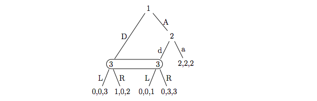
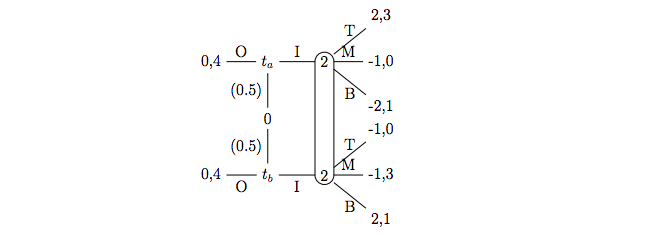

```{r setup, include=FALSE}
knitr::opts_chunk$set(echo = TRUE)

library(tidyverse)
```

1. Consider an infinite repetition of the normal form game below, in which both players discount the future at rate $\delta \in (0, 1)$. For what values of $\delta$ can the play path $\{(C, C),(C, C), ...\}$ be supported in a subgame perfect equilibrium?

```{r 1, echo=FALSE, out.width = '100%'}

```

Consider the one-shot deviation principle.  The payoff from following the strategy for eternality:

$$
(1 - \delta)\Bigg(2 \sum_{t=0}^\infty \delta^t\Bigg) = 2
$$

The payoff from deviating one-period and getting the one-period Nash equilibrium for eternality:

$$
(1 - \delta)\Bigg(8 + \Bigg(1 \sum_{t=1}^\infty \delta^t\Bigg)\Bigg) 
= (1-\delta) 8 + 1
$$

Find the $\delta$ where the payoff from following the strategy for eternality is higher than the one-period deviation:

$$
\implies 
2 \ge (1-\delta) 8 + 1 
\implies
\delta \ge \frac{7}{8}
$$

\pagebreak

2. Consider an infinite repetition of the following two-player normal form game.  Consider the following repeated game strategy profile $\delta$: (I) Play (C,C) initially, or if (C,C) was played last period; (II) If there is a deviation from (I), play (P,P) once and then restart (I); (III) If there is a deviation from (II), then restart (II). Now answer the following questions:

```{r 2, echo=FALSE, out.width = '100%'}

```

(a) For what values of $\delta$ is strategy profile $\sigma = (\sigma_1, \sigma_2)$ a subgame perfect equilibrium?

...

(b) Suppose that in the stage game, action profile $(P, P)$ results in both players receiving a payoff of 1/2 rather than a payoff of 0. In this case, what are the values of $\delta$ for which strategy profile $\sigma = (\sigma_1, \sigma_2)$ is a subgame perfect equilibrium?

...

(c) Give intuitive explanations for any differences in the results of your analyses of parts (a) and (b).

...

(d) What is the set of payoffs supportable as a subgame perfect equilibrium (if possible, using a public randomizing device) for some $\delta < 1$?

...

3. In the three-player normal form game $G$, each player’s pure strategy set is $S_i = \{A, B, C, D\}$. Payoffs in $G$ are described as follows: If any player plays $D$, all players obtain a payoff of 0. If one player plays $A$, one $B$, and one $C$, then the $A$ player’s payoff is 2, the $B$ player’s payoff is 0, and the $C$ player’s payoff is -1. Under any other strategy profile, all players obtain -2.

(a) Let $G^\infty(\delta)$ be the infinite repetition of $G$ at discount rate $\delta \in (0, 1)$. Construct a pure strategy profile whose equilibrium play path is $(A, B, C),(B, C, A),(C, A, B),(A, B, C),(B, C, A),(C, A, B), ...$ and that is a subgame perfect equilibrium of $G^\infty$ for large enough values of $\delta$. For which values of $\delta$ is the strategy profile you constructed a subgame perfect equilibrium?

...

(b) Now consider the play path $(A, B, C),(C, A, B),(B, C, A),(A, B, C),(C, A, B),(B, C, A), ...$ Is play path (II) attainable in a subgame perfect equilibrium for a smaller or larger set of discount rates than play path (I)? Provide intuition for your answer.

...

4. In the game $\Gamma$, player 1 moves first, choosing between actions $A$ and $B$. If he chooses $B$, then player 2 chooses between actions $C$ and $D$. If she chooses $D$, then player 1 moves again, choosing between actions $E$, $F$, and $G$.

(a) Find a behavior strategy which is equivalent to the mixed strategy 

$$
\sigma_1 = \Bigg( \sigma_1(AE), \sigma_1(AF), \sigma_1(AG), \sigma_1(BE), \sigma_1(BF), \sigma_1(BG) \Bigg) = \Bigg( \frac{1}{2}, \frac{1}{2}, 0, 0, \frac{1}{12}, \frac{1}{12} \Bigg)
$$

...

(b) Describe all mixed strategies which are equivalent to the behavior strategy

$$
\beta_1 = \Bigg(\Big( \beta_1(A), \beta_1(B)\Big), \Big( \beta_1(E), \beta_1(F), \beta_1(G)\Big) \Bigg) = \Bigg(\Big( \frac{1}{3}, \frac{2}{3}\Big), \Big( \frac{1}{2}, \frac{1}{4}, \frac{1}{4} \Big) \Bigg)
$$

...

5. Compute all sequential equilibria of the following game.

```{r 5, echo=FALSE, out.width = '100%'}

```

...

6. For the game in the figure below, specify an assessment (i.e., a strategy profile and a belief profile) with these three properties: (i) beliefs are Bayesian; (ii) no player has a profitable one-shot deviation at any information set; (iii) the assessment is not a weak sequential equilibrium.

```{r 6, echo=FALSE, out.width = '100%'}

```

...

7. Compute all sequential equilibria of the game in the figure below. For each equilibrium, identify whether it is a pooling or separating equilibrium, and whether it satisfies the intuitive criterion.

```{r 7, echo=FALSE, out.width = '100%'}

```

...

8. Consider the following card game: Players 1 and 2 each bet $1 by placing it on
the table. Player 1 is dealt a card that only he sees. This card can be an Ace,
King, or Queen, with each card being equally likely. After seeing his card, player 1 decides whether to raise the bet to $2 (i.e., place another dollar on the table) or fold; if he folds, player 2 takes the money on the table. If player 1 raises, player 2 can call (i.e., place another dollar on the table) or fold; if she folds, player 1 takes the money on the table. If player 2 calls, then player 1 takes the money on the table if he has an Ace; otherwise, player 2 takes the money on the table.

(a) Draw an extensive form game $\Gamma$ that represents this interaction.

...

(b) What is each player’s pure strategy set in $\Gamma$?

...

(c) Find all sequential equilibria of $\Gamma$.

...