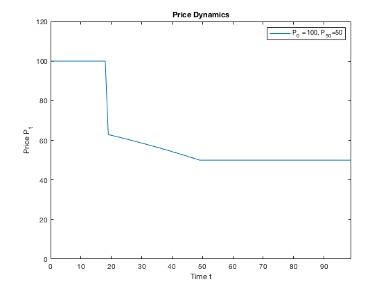

```{r setup, include=FALSE}
knitr::opts_chunk$set(echo = TRUE)
```

Here we are interested in how the stock market may react to a future FOMC announcement of an increase in short term interest rates. To do so, consider the following simple perfect foresight model of stock price dynamics given by the following equation

\begin{align}
p_t = \frac{d+p_{t+1}}{(1+r)}
\end{align}

where $p_t$ is the price of a share at the beginning of period $t$ before constant dividend $d$ is paid out, and $r$ is the short term risk free interest rate. The left hand side of (1) is the cost of buying a share while the right hand side is the benefit of buying the share (the owner receives a dividend and capital gain or loss from the sale of the share). Assume $r > 0$.

1. Solve for the steady state stock price $p^* = p_t=p_{t+1}$.

\begin{align*}
p^* &= \frac{d+p^*}{(1+r)} \\
p^*+rp^* &= d+p^* \\
p^* &= d/r\\
\end{align*}

2. Assume the initial price, $p_0$, is given. Solve the closed form solution to the first order linear difference equation in (1). Explain how price evolves over time (i.e. if $p_0 > p^*, p_0 < p^*, p_0 = p^*$) using both a phase diagram (i.e. $p_{t+1}$ against $p_t$) as well as a graph of $p_t$ against time $t$. If the initial stock price is away from the steady state, does it converge or diverge from the steady state. Explain why.

Rewriting (1), as $p_{t+1} = f(p_t)$:

\begin{align*}
p_t &= \frac{d+p_{t+1}}{(1+r)} \\
\implies p_{t+1} &= (1+r)p_{t} - d\\
\implies p_{t+1} &= ap_{t} + b \text{ where } a = 1+r \text{ and } b = -d.
\end{align*}

For complementary function, use $p_t^c=ca^t$ and use $p^p_t = p^*$ for the particular solution.  Thus, the general solution is $p_t^g = p_t^c+p^p_t = ca^t + p^*$. Using $p^g_0=p_0$ as a boundary solution, $p_0= ca^0 + p^* \implies c =p_0 - p^*$.  Thus,

$$
p_t = (p_0-p^*)a^t+p^* \text{ where } a=1+r \text{ and } p^*=d/r.
$$

Because $|a| = |1+r| > 1$, the price diverges unless $p_0 = p^*$.  If $p_0 < p^*$, $p_t \to -\infty$ as $t \to \infty$ and, if $p_0 > p^*$, $p_t \to \infty$ as $t \to \infty$.

```{r, echo=FALSE}
plot(1, type="n", xlim=c(0, 1), ylim=c(0, 1), xlab = "p_t", ylab = "p_(t+1)", xaxs="i", yaxs="i", xaxt='n', yaxt='n', main = "Phase Diagram")

axis(1, at=.5, labels="p*")
axis(2, at=.5, labels="p*")

abline(a=0, b=1, col = "red", lty=2)
abline(a=-.2, b=1.4, col ="blue")

segments(x0 = 0.5, x1=0.5, y0=0, y1=0.5, lty = 2)
segments(x0 = 0, x1=0.5, y0=0.5, y1=0.5, lty = 2)

text(x=.9, y=.7, labels = "p_(t+1)=p_t", col = "red")
text(x=.6, y=.9, labels = "p_(t+1)=f(p_t)", col = "blue")
```

```{r, echo=FALSE}
r <- 0.2
d <- 1
p_star <- d/r

p_0_eq <- p_star
p_0_pos <- p_0_eq + 0.5
p_0_neg <- p_0_eq - 0.5

t <- 0:10

p_t_eq <- (p_0_eq-p_star)*(1+r)^t+p_star 
p_t_pos <- (p_0_pos-p_star)*(1+r)^t+p_star 
p_t_neg <- (p_0_neg-p_star)*(1+r)^t+p_star 

plot(1, type="n", xlim=c(0, 10), ylim=c(0, 10), ylab = "p_t", xlab = "t", xaxs="i", yaxs="i", yaxt='n', main = "Price Dynamics")

axis(2, at=5, labels="p*")

points(x=t, y=p_t_eq)
points(x=t, y=p_t_pos, col="red")
points(x=t, y=p_t_neg, col="blue")

lines(x=t, y=p_t_eq)
lines(x=t, y=p_t_pos, col="red")
lines(x=t, y=p_t_neg, col="blue")

text(x=2, y=8, labels = "p_0 > p*", col = "red")
text(x=2, y=2, labels = "p_0 < p*", col = "blue")
text(x=8, y=6, labels = "p_0 = p*")
```

\pagebreak

3. [Matlab] Suppose the risk free rate is $r=1$% and the stock pays constant dividend $d=1$ per share per period.  Open the Matlab code we provided. The code generates and plots the price dynamics given the first-order difference equation in part 2 given the initial share price $p_0=100$ at time $t=0$. Modify the code (i.e. simply replace 100) with three different initial prices which respectively are below, at, and above the steady state price level implied by these parameters to plot the price dynamics over 100 periods.

See included Matlab file (ps1_vonhafften.m).


\pagebreak

4. [Analytical and Matlab] Suppose the Federal Reserve announces at $t=20$ to raise the federal funds rate from 1% to 2% at $t=50$ and remain at the new level forever.  Using (1) with $d=1$, how does the price respond to the policy announcement and the interest rate change over time?  Plot the price dynamics from $t=0$ to $t=99$. Please assume that we rule out rational bubbles (i.e., agents know and believe that prices will be at its fundamental value, the steady state, at $t=50$).

Let $r_{pre}$ be the risk-free rate before the interest rate change and $r_{post}$ be the risk-free rate after the change.  Before the announcement, as assumed, the price is at the steady state price of $d/r_{pre}=1/0.01=100$.  After the rates change in $t=50$, the new steady state price is $d/r_{post}=1/0.02=50$.  Since we assume that agents believe that the price will be at its steady state in $t=50$, we can use (1) to find the price in $t=49$: $p_{49} = \frac{d+p_{50}}{(1+r_{pre})}=\frac{1+50}{(1+0.01)} \approx 50.495$. Similarly, we can use (1) to find the price in $t=48$ based on the price in $t=49$. Thus, we can iterate back until the announcement date.  Putting everything together, the price is at the steady state associated with a risk-free rate of 0.01 until $t=20$.  In $t=20$, the price drops so that over the next thirty periods, it will reach the steady state price associated with a risk-free rate of 0.02 based on (1).



