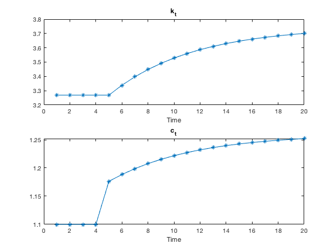
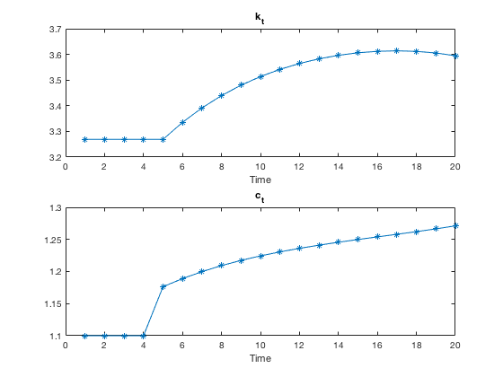
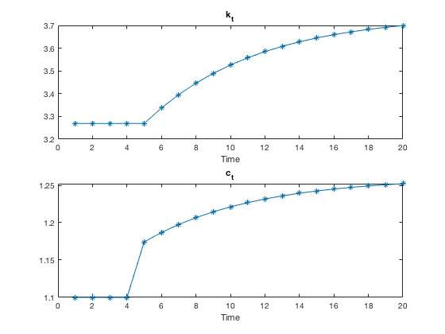

```{r setup, include=FALSE}
knitr::opts_chunk$set(echo = TRUE)
```

# Problem 1: Two-dimensional non-linear system

Consider the Ramsey model of consumption $c_t$ and capital $k_t$:

\begin{align}
k_{t+1} &= f(k_t) + (1 - \delta)k_t - c_t \\
\beta u' (c_{t+1}) &= \frac{u'(c_t)}{1-\delta + f'(k_{t+1})}
\end{align}

parametrized by: $f(k) = zk^\alpha, z=1, \alpha=0.3, \delta = 0.1, \beta = 0.97, u(c) = \log(c)$.

1. Solve for steady state $(\bar{k}, \bar{c})$.

The functional forms provided imply:

\begin{align*}
f(k) = zk^\alpha &\implies f'(k) = z \alpha k^{\alpha - 1} \\
u(c) = \log(c) &\implies u(c) = c^{-1}
\end{align*}

Setting $\bar{c}:=c_t=c_{t+1}, \bar{k}:=k_t=k_{t+1}$:

\begin{align*}
(2)
\implies c_{t+1} &= \beta c_t(1-\delta + z \alpha k_{t+1}^{\alpha - 1}) \\
\implies 1 &= \beta (1-\delta + z \alpha \bar{k}^{\alpha - 1}) \\
\implies \bar{k} &= \Bigg( \frac{\beta^{-1}-1+\delta}{z\alpha} \Bigg)^{\frac{1}{\alpha-1}} \\
\implies \bar{k} &\approx 3.2690
\end{align*}

\begin{align*}
(1) 
&\implies \bar{c} = z \bar{k}^\alpha + (1 - \delta)\bar{k} - \bar{k} \\
&\implies \bar{c} = z \Bigg( \frac{\beta^{-1}-1+\delta}{z\alpha} \Bigg)^{\frac{\alpha}{\alpha-1}} + \delta \Bigg( \frac{\beta^{-1}-1+\delta}{z\alpha} \Bigg)^{\frac{1}{\alpha-1}} \\
&\implies \bar{c} \approx 1.0998
\end{align*}

The steady state is $(\bar{k}, \bar{c})=(3.2690, 1.0998)$.

\pagebreak

2. Linearize the system around its steady state.

Rewrite equations (1) and (2) as $k_{t+1}=g(k_t, c_t)$ and $c_{t+1}=h(k_t, c_t)$:

\begin{align*}
(1) \implies k_{t+1} &= zk_t^\alpha + (1 - \delta)k_t - c_t \\
(2) \implies c_{t+1} &= \beta c_t(1-\delta + z \alpha k_{t+1}^{\alpha - 1}) \\
&= \beta c_t(1-\delta + z \alpha (zk_t^\alpha + (1 - \delta)k_t - c_t)^{\alpha - 1})
\end{align*}

The Jacobian is $J = \begin{pmatrix} dk_{t+1}/dk_t & dk_{t+1}/dc_t \\ dc_{t+1}/dk_t & dc_{t+1}/dc_t \end{pmatrix}$ where

\begin{align*}
dk_{t+1}/dk_t &= z \alpha k_t^{\alpha-1} + 1 - \delta \\
dk_{t+1}/dc_t &= -1\\ 
dc_{t+1}/dk_t &= z \alpha \beta c_t (\alpha - 1)(zk_t^\alpha+(1-\delta)k_t-c_t)^{\alpha - 2}(z \alpha k_t^{\alpha-1} + 1 - \delta)\\
dc_{t+1}/dc_t &= (1 - \delta)\beta + z \alpha \beta [(zk_t^\alpha + (1 - \delta)k_t-c_t)^{\alpha-1}-c_t(\alpha - 1)(zk_t^\alpha + (1 - \delta)k_t - c_t)^{\alpha-2}]
\end{align*}

Using first-order Taylor approximation, the system can be written in terms of deviations from steady state $\tilde{k}_t = k_t - \bar{k}$ and $\tilde{c}_t = c_t - \bar{c}$:

$$
\begin{pmatrix} \tilde{k}_{t+1} \\ \tilde{c}_{t+1} \end{pmatrix} = J\begin{pmatrix} \tilde{k}_{t} \\ \tilde{c}_{t} \end{pmatrix}
$$

3. Compute numerically eigenvalues and eigenvectors of the Jacobian at the steady state. Verify that the system has a saddle path.  What is the slope of the saddle path at the steady state?

At $(\bar{k}, \bar{c})=(3.269, 1.100)$ and the above parameters.

$$
J = \begin{pmatrix} 1.0309 & -1 \\-0.0308 & 1.0299 \end{pmatrix}
$$

The eigenvectors and eigenvalues for $J$ are:

\begin{align*}
\Lambda 
&= \begin{pmatrix} \lambda_1 & 0 \\ 0 & \lambda_2 \end{pmatrix} 
= \begin{pmatrix} 1.2060 & 0 \\ 0 & 0.8548 \end{pmatrix} \\
E 
&= 
\begin{pmatrix} e_{11} & e_{12} \\ e_{21} & e_{22} \end{pmatrix} 
=
\begin{pmatrix} 0.9850 & 0.9848 \\-0.1725 & 0.1734 \end{pmatrix} \\
\begin{pmatrix} k_t \\ c_t \end{pmatrix} &= 
\begin{pmatrix} e_{11} & e_{12} \\ e_{21} & e_{22} \end{pmatrix}  \begin{pmatrix} m_1 \lambda_1^t \\ m_2 \lambda_2^t \end{pmatrix}
\end{align*}

The system has a saddle path because the absolute value of one eigenvalue is greater than one and the absolute value of the other eigenvalue is less than one. The saddle path is $(k_t, c_t)$ where $m_1 = 0$.

\begin{align*}
\begin{pmatrix} k_t \\ c_t \end{pmatrix} = 
\begin{pmatrix} e_{11} & e_{12} \\ e_{21} & e_{22} \end{pmatrix}  \begin{pmatrix} 0 \\ m_2 \lambda_2^t \end{pmatrix}
= \begin{pmatrix} e_{12}m_2 \lambda_2^t \\ e_{22}m_2 \lambda_2^t \end{pmatrix}
\end{align*}

So, the slope of the saddle path at the steady state is $\frac{e_{22}m_2 \lambda_2^t}{e_{12}m_2 \lambda_2^t} = \frac{e_{22}}{e_{12}}=\frac{0.1734}{0.9848}=0.1761$.

\pagebreak

4. On a phase diagram in $(k_t, c_t)$ show how the system evolves after an unexpected permanent positive productivity shock at $t_0, z'>z$. (You don't need to plot lines precisely - do this by hand, but pay attention to vector field (arrows), relative position of old and new steady states, directions of saddle paths and system trajectory after the shock.)

\begin{align*}
\Delta k_{t+1} &= 0 \\
\implies k_{t+1}-k_{t} &= 0\\
\implies (f(k_t) + (1 - \delta)k_t - c_t) -k_{t} &= 0\\
\implies c_t &= f(k_t) - \delta k_t
\end{align*}

\begin{align*}
\Delta c_{t+1} &= 0 \\
\implies c_{t+1} &= c_{t} \\
\implies \beta u'(c_{t+1}) &= \beta u'(c_{t}) \\
\implies \frac{u'(c_{t})}{1-\delta+f'(k_{t+1})} &= \beta u'(c_{t}) \\
\implies f'(k_{t+1}) &= \beta^{-1} - 1 + \delta \\
\implies k_{t+1} &= \bar{k} \\
\implies c_t &= f(k_t)+(1-\delta)k_t-\bar{k}
\end{align*}


```{r, echo = FALSE}

library(shape)

z <- 1
z2 <- 1.1
alpha <- 0.3
delta <- 0.1
beta <- 0.97

k_bar = (((beta^-1)-1+delta)/(z*alpha))^(1/(alpha-1))
c_bar = z * k_bar^alpha - delta * k_bar

k_bar2 = (((beta^-1)-1+delta)/(z2*alpha))^(1/(alpha-1))
c_bar2 = z2 * k_bar2^alpha - delta * k_bar2

k <- (0:1000)/100

delta_k_zero <- z*k^alpha-delta*k
delta_c_zero <- z*k^alpha+(1-delta)*k - k_bar

delta_k_zero2 <- z2*k^alpha-delta*k
delta_c_zero2 <- z2*k^alpha+(1-delta)*k - k_bar2

plot(1, type ="n", xlim=c(0, 6), ylim=c(-4, 4), xaxs="i", yaxs="i", xlab="k_t", ylab="c_t", main = "Phase Diagram with Vector Field Arrows")
abline(h=0)

lines(y=delta_k_zero, x=k, lty=1)
lines(y=delta_c_zero, x=k, lty=1, col = "blue")
lines(y=delta_k_zero2, x=k, lty=2)
lines(y=delta_c_zero2, x=k, lty=2, col = "blue")

x <- c(.5, 1, 5.5, 2.5)
y <- c(-1, 2, 2.5, -2)

points(x, y, pch=16)

Arrows(x0 = x, 
       y0 = y,
       x1 = x + .3*c(1, -1, -1, 1),
       y1 = y,
       arr.type = "triangle")

Arrows(x0 = x,
       y0 = y,
       x1 = x,
       y1 = y+ .7*c(1, 1, -1, -1),
       arr.type = "triangle")

legend("bottomright",
  c("k_t = k_(t+1), z = 1",
    "k_t = k_(t+1), z = 1.1",
    "c_t = c_(t+1), z = 1",
    "c_t = c_(t+1), z = 1.1"),
  lty = c(1, 2, 1, 2),
  col=c("black", "black", "blue", "blue"),
  cex=.7,
  bty= "n")

```

```{r, echo = FALSE}

plot(1, type ="n", xlim=c(3, 4), ylim=c(.9, 1.3), xaxs="i", yaxs="i", xlab="k_t", ylab="c_t",  main = "Phase Diagram with Saddle Paths")
abline(h=0)

lines(y=delta_k_zero, x=k, lty=1)
lines(y=delta_c_zero, x=k, lty=1, col = "blue")
lines(y=delta_k_zero2, x=k, lty=2)
lines(y=delta_c_zero2, x=k, lty=2, col = "blue")

text(x = 2.5, y = 2, labels = "k_t = k_(t+1)")
text(x = 2, y = -2, labels = "c_t = c_(t+1)", col="blue")

points(x=k_bar, y=c_bar, pch = 4, col = "red")
points(x=k_bar2, y=c_bar2, pch = 8, col = "red")

sd_slope <- 0.1761

abline(a= c_bar-k_bar*sd_slope, b=sd_slope, col = "green")
abline(a= c_bar2-k_bar2*sd_slope, b=sd_slope, lty=2, col = "green")

segments(x0=k_bar, x1=k_bar2, y0=c_bar2-k_bar2*sd_slope+k_bar*sd_slope, y1=c_bar2, col ="red", lwd=3)
segments(x0=k_bar, x1=k_bar, y0=c_bar2-k_bar2*sd_slope+k_bar*sd_slope, y1=c_bar, col ="red", lwd=3, lty=3)

legend("bottomright",
  c("k_t = k_(t+1), z = 1",
    "k_t = k_(t+1), z = 1.1",
    "c_t = c_(t+1), z = 1",
    "c_t = c_(t+1), z = 1.1",
    "Saddle path, z=1",
    "Saddle path, z=1.1",
    "Trajectory between steady states"),
  lty = c(1, 2, 1, 2, 1, 2, 1),
  lwd=c(1, 1, 1, 1, 1, 1, 3),
  col=c("black", "black", "blue", "blue", "green", "green", "red"),
  cex=.7,
  bty= "n")

legend("topleft",
  c("Steady state, z=1",
    "Steady state, z=1.1"),
  col="red",
  cex=.7,
  pch=c(4, 8),
  bty= "n")

```

\pagebreak

5. (continuing from 4) Compute numerically and plot trajectories of $k_t$ and $c_t$ for $t=1, 2, ..., 20$ if the productivity shock occurs at $t_0=5$ and $z=z+0.1$. For this question, we will be looking at the linearized version of the nonlinear system around the new steady state.

The new steady state $(\bar{k}', \bar{c}')$ and Jacobian matrix at that point are

$$(\bar{k}', \bar{c}') \approx (3.7458, 1.2602)$$

$$J \approx \begin{pmatrix} 1.0309 & -1 \\ -0.0308 & 1.0299 \end{pmatrix}$$

Diagonalizing the system using eigenvectors:

$$ \Lambda \approx \begin{pmatrix} 1.2060 & 0 \\ 0 & 0.8548 \end{pmatrix}$$

$$ E \approx \begin{pmatrix} 0.9850 & 0.9848 \\ -0.1725 & 0.1734 \end{pmatrix}$$

Rewriting it in terms of $\hat{k}_t$ and $\hat{c}_t$:

$$\begin{pmatrix} \hat{k}_t \\ \hat{c}_t \end{pmatrix} = E^{-1} \begin{pmatrix} k_t \\ c_t \end{pmatrix} \implies \begin{pmatrix} \hat{k}_{t+1} \\ \hat{c}_{t+1} \end{pmatrix} = \Lambda \begin{pmatrix} \hat{k}_t \\ \hat{c}_t \end{pmatrix}$$

Since $\hat{k}_{t+1}=\lambda_1\hat{k}_{t} \iff \hat{k}_t=m_1\lambda_1^t=m_1(1.2060)^t$ and $\hat{c}_{t+1}=\lambda_1\hat{c}_{t} \iff \hat{k}_t=m_2\lambda_2^t = m_2(0.8548)^t$. For the solution to be nonexplosive, $m_1 = 0$:

\begin{align*}
\hat{k}_t &= (0)\lambda_1^t=0\\
\hat{c}_t &= m_2\lambda_2^t
\end{align*}

Rewriting the in terms of $(k_t, c_t)$:

\begin{align*}
\begin{pmatrix} \tilde{k}_t \\ \tilde{c}_t \end{pmatrix} 
= E \begin{pmatrix} \hat{k}_t \\ \hat{c}_t  \end{pmatrix} 
= \begin{pmatrix} e_{11} & e_{12} \\ e_{21} & e_{22} \end{pmatrix} \begin{pmatrix} 0 \\ m_2 \lambda_2^t \end{pmatrix}
\end{align*}

\begin{align*}
k_t^g
&= e_{11}(0) + e_{12}m_2\lambda_2^t + \bar{k} \\
&= e_{12}m_2\lambda_2^t+ \bar{k}\\
c_t^g &= e_{21}(0) + e_{22}m_2\lambda_2^t+ \bar{c}\\
&= e_{22}m_2\lambda_2^t+ \bar{c}
\end{align*}

Now, we pin down a particular saddle path trajectory using a boundary condition $k_{t_0}=\bar{k}$ to find $m_2$:

\begin{align*}
k_{t_0} &= \bar{k_{old}} \\
\implies e_{12}m_2\lambda_2^{t_0} + \bar{k}_{new} &= \bar{k}_{old}\\
\implies m_2 &= \frac{\bar{k}_{old} - \bar{k}_{new}}{e_{12}\lambda_2^{t_0}}\\
\implies m_2 &= \frac{3.2690 - 3.7458}{(0.9848)0.8548^5}\\
\implies m_2 &= -1.0607\\
\end{align*}

Thus, $c_{t_0}$ is:

\begin{align*}
c_{t_0} &= e_{22}m_2\lambda_2^{t_0}+ \bar{c} \\
&= (0.1734)(-1.0607)(0.8548)^5 + (1.2602) \\ 
&= 1.1762
\end{align*}

Using the particular solution, we can compute and graph $k_t$ and $c_t$ after the shock. For $t=\{5,...20\}$:

\begin{align*}
k_t^g &= e_{12}m_2\lambda_2^t+ \bar{k} = (0.9848)(-1.0607)(0.8548)^t + (3.7458)\\
c_t^g &= e_{22}m_2\lambda_2^t+ \bar{c} = (0.1734)(-1.0607)(0.8548)^t + (1.2602)
\end{align*}




\pagebreak

6. For this question, we explore the nonlinear nature of the system and numerically solve the actual transition path using the "shooting method".

(a) In the previous question, you solve $c_{t_0}$ under the linear system.  Put $(k_{t_0}, c_{t_0}$ into the nonlinear system (1) and (2). Compute and graph how the system evolves.  Does it converge to a steady state?

No, the system does not converge to the steady state (see figure 2).  The level of consumption at $t_0$ is above the saddle path associated with the new steady state, so consumption overshoots the new steady state.  Thus, capital is lower than the saddle path and starts to drop before reaching the level associated with the new steady state.



\pagebreak

(b) Use "shooting method" to find the actual $c_{t_0}$ needed.  The method is to try different values of $c_{t_0}$ such that after long enough time, the system will converge to the new steady state.



\pagebreak

# Problem 2: Setting up a model

* For the problems below, state the Social Planner Problem (SPP), the Consumer Problem (CP), and define the Competitive Equilibrium (CE).  (Don't solve).

1. Consider an overlapping generations economy of 2-period-lived agents. There is a constant measure of $N$ agents in each generation.  New young agents enter the economy at each date $t\ge 1$.  Half of the young agents are endowed with $w_1$ when young and 0 when old.  The other half are endowed with 0 when young and $w_2$ when old.  There is no savings technology.  Agents order their consumption stream by $U(c_t^t, c_{t+1}^t) = \ln c_t^t + \ln c_{t+1}^t$. There is a measure $N$ of initial old agents. Half of them are endowed with $w_2$ and the other half endowed with 0. Each old agent order their consumption by $c_1^0$. Each old agent is endowed with $M$ units of fiat currency. No other generation is endowed with fiat currency, and the stock of fiat currency is fixed over time.

### Social Planner Problem

In any period $t$, the social planner weights generations alive equally and optimally allocates resources between them given preferences and technologies. The resource constraint in period $t$ is

$$
Nc_t^t + Nc_t^{t-1} \le \frac{N}{2}w_1+\frac{N}{2}w_2
$$

Thus, the social planner's problem is

\begin{align*}
\max_{(c_t^t, c_t^{t-1}) \in \R^2_+} & \ln (c_t^t) + \ln (c_t^{t-1}) \\
\text{s.t. } &c_t^t + c_t^{t-1} \le  \frac{w_1+w_2}{2}
\end{align*}

### Consumer Problem

For the consumer problem, I break it up into the problem facing four different types of agents: an initial old agent that does not receive an endowment, an initial old agent that does receive an endowment, an agent born in generation $t > 0$ that receives an endowment when young, and an agent born in generation $t > 0$ that receives an endowment when old.  Let $p_t$ be the number of dollar for 1 unit of the consumption good in period $t$.

First, the problem of an initial old person without an endowment is

\begin{align*}
\max_{c_1^0 \in \R_+} & \ln (c_1^0) \\
\text{s.t. } & p_1c_1^0 \le M 
\end{align*}

Second, the problem of an initial old person that receives an endowment

\begin{align*}
\max_{c_1^0 \in \R_+} & \ln (c_1^0) \\
\text{s.t. } &p_1c_1^0 \le M + p_1w_2
\end{align*}

Now, let us turn to agents born in generations $t > 0$. Define $m_{t+1}^t \in \R$ as the monetary holding by agents born in generation $t$ that recieves an endowment while young between periods $t$ and $t+1$.\footnote{I am interpreting "there is no savings technology" to mean that agents cannot save the consumption between periods, but that they can save the fiat currency.} If $m_{t+1}^t > 0$, then $m_{t+1}^t$ represents the holding of fiat currency. Assuming there is a commitment technology that enforces agents paying back IOUs to other agents, then $m_{t+1}^t < 0$ represents inside money. Thus, the problem facing agents born in generation $t > 0$ that are endowed when young is

\begin{align*}
\max_{(c_t^t, c_{t+1}^t) \in \R^2_+; m_{t+1}^t \in \R} & \ln (c_t^t) + \ln (c_{t+1}^t) \\
\text{s.t. } & p_t c_t^t \le p_t w_1- m_{t+1}^t \\ 
             & p_{t+1} c_{t+1}^t \le m_{t+1}^t \\
\end{align*}

Similarly, define $b_{t+1}^t \in \R$ as the monetary holding by agents born in generation $t$ that recieves an endowment while old between periods $t$ and $t+1$.  The problem facing agents born in generation $t > 0$ that are endowed when old is

\begin{align*}
\max_{(c_t^t, c_{t+1}^t) \in \R^2_+; b_{t+1}^t \in \R} & \ln (c_t^t) + \ln (c_{t+1}^t) \\
\text{s.t. } & p_t c_t^t \le -b_{t+1}^t \\ 
             & p_{t+1}c_{t+1}^t \le p_{t+1}w_2 + b_{t+1}^t \\
\end{align*}

### Competitive Equilibrium:

A competitive equilibrium is the allocation $\{(c_t^t, c_t^{t-1}\}_{\forall t}$ and prices $\{p_t\}_{\forall t}$ such that agents optimize:

\begin{align*}
\max_{m_{t+1}^t \in \R} & \ln \Bigg(w_1- \frac{m_{t+1}^t}{p_t}\Bigg) + \ln \Bigg(\frac{m_{t+1}^t}{p_{t+1}} \Bigg)\\
\max_{b_{t+1}^t \in \R} & \ln \Bigg(- \frac{b_{t+1}^t}{p_t}\Bigg) + \ln \Bigg(w_2+\frac{b_{t+1}^t}{p_{t+1}} \Bigg)
\end{align*}

and markets clear:

\begin{align*}
c_t^t+c_t^{t-1} &= w_1 + w_2 \\
m_{t+1}^t + b_{t+1}^t &= M.
\end{align*}

\pagebreak

2. Consider an overlapping generations economy with 3-period-lived agents. Denote these periods as young, mid, and old.  At each date $t \ge 1$, $N_t$ new young agents enter the economy, each endowed with $w_1$ units of the consumption good when young, $w_2$ units when mid, and $w_3$ units when old.  The consumption good is non-storable.  The population is described by $N_{t+1}=n * N_t$, where $n >0$. Consumption preference is described by $\ln c_t^t + \ln c_{t+1}^t + \ln c_{t+2}^t$. At time $t = 1$, there is a measure $N_{-1}$ of old agents, each endowed with $w_3$ units of the consumption good, and a measure of $N_0$ mid agents, each endowed with $w_2$ units of the consumption good at $t=1$ and $w_3$ units at $t=2$.  Additionally, each initial old agent is endowed with 1 unit of a fiat currency.

Social Planner Problem:

Consumer Problem:

Competitive Equilibrium:

* (Cake eating problem) Consider a single infinitely lived agent with preference over their consumption stream $\textbf{c}=\{c_t\}$, given by $U(\textbf{c}) = \sum_{t=1}^\infty \beta^t u(c_t)$, where $\beta < 1$ and $u(\cdot)$ is increasing and concave.  Consumption cannot be negative in any period. The agent is endowed with $k_1$ units of the consumption good in period $t=1$. There is a perfect storage technology, such that the consumption good is effectively infinity durable. State the agent's problem (don't solve).


