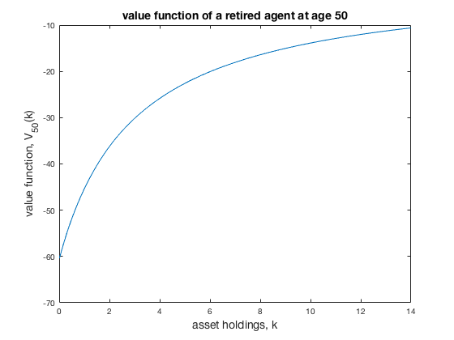
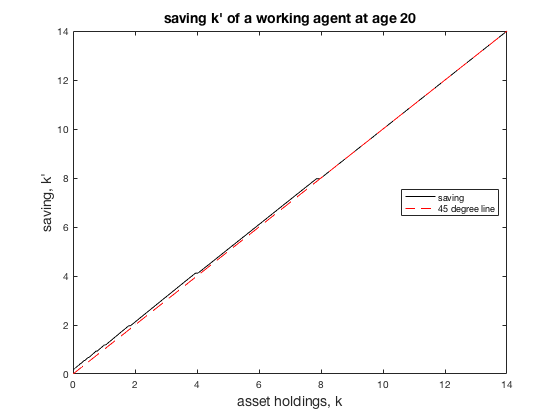
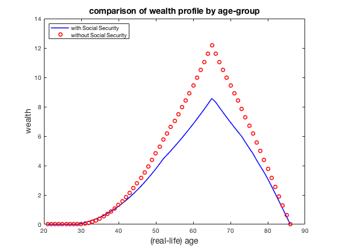

```{r setup, include=FALSE}
knitr::opts_chunk$set(echo = TRUE)
library(rmatio)
library(knitr)
library(tidyverse)
```

In this problem set we study the macroeconomic consequences of eliminating the Social Security system in the U.S. To do so, we set up and solve a simple general equilibrium overlapping generations model.  This model is a simplified version of the model by Conesa and Krueger (1999). You are not required to write the code from scratch to solve this model, we provide you with already written code with some missing parts.  You are asked to understand the logic of the code, complete missing parts and use it to run policy experiments.

# 1 Model

Consider the model presented during Friday's discussion section.

Each period a continuum of agents is born. Agents live for $J$ periods after which they die. The population growth rate is $n$ per year (which is the model period length). Thus, the relative size of each cohort of age $j$, $\psi_j$, is given by: 

$$\psi_{i+1} = \frac{\psi_i}{1+n}$$

for $i=1, ..., J - 1$ with $\psi_1 = \bar{\psi} > 0$.  It is convenient to normalize $\psi$, so that it sums up to 1 across all age groups.

Newly born agents (i.e. $j=1$) are endowed with no initial capital (i.e., $k_j=0$) but can subsequently save in capital which they can rent to firms at rate $r$. A worker of age $j$ supplies labor $\ell_j \in [0,1]$ and pays proportional social security taxes on her labor income $\tau w e_j \ell_j$ until she retires at age $J^R < J$, where $e_j$ is the age-efficiency profile. Upon retirement, agent receives pension benefits $b$.

The instantaneous utility function of a worker at age $j=1, 2, ..., J^R-1$ is given by: 

$$u^{W} (c_j, \ell_j) = \frac{(c_j^{\gamma}(1-\ell_j)^{1-\gamma})^{1-\sigma}}{1 - \sigma}$$

with $c_j$ denoting consumption and $\ell_j$ denoting labor supply at age $j$. The weight on consumption is $\gamma$ and the coefficient of relative risk aversion is $\sigma$. The instantaneous utility function of a retired agent at age $j = J^R, ..., J$ is given by: 

$$u^R(c_j) = \frac{c_j^{1-\sigma}}{1-\sigma}.$$

\pagebreak

Preferences are then given by 

$$\sum_{j=1}^{J^R-1}\beta^{j-1}u^W(c_j, \ell_j) + \sum_{j=J^R}^J \beta^{j-1}u^R(c_j)$$

There is a constant returns to scale production technology $Y=F(K, L)=K^\alpha L^{1-\alpha}$ with $\alpha$ denoting capital share, $Y$ denoting aggregate output, $K$ denoting aggregate capital stock, and $L$ denoting aggregate effective labor supply. The capital depreciates at rate $\delta$. Capital and labor markets are perfectly competitive.

## 1.1 Parametrization

\begin{align*}
J &= 66 \\
J^R &= 46 \\
n &=  0.011  \\
k_1 &= 0 \\
\tau &= 0.11 \\
\gamma &= 0.42 \\
\sigma &= 2 \\
\beta &= 0.97  \\
\alpha &= 0.36 \\
\delta &= 0.06 \\
\end{align*}

# 2 Questions

## 2.1

Derive the below equation for labor supply, used in the solution of workers' recursive problem (refer to lecture notes for details).

$$
\ell = \frac{\gamma(1-\tau)e_jw-(1 - \gamma)[(1+r)k-k']}{(1-\tau)e_jw}
$$

The dynamic programming problem of a $j$-year-old worker, $j=1, ..., J^R-1$, is given by (equation (8) from the section handout):

\begin{align*}
V_j(k) = \max_{k', \ell} & \{u^{W}((1 - \tau)we_j\ell+(1+r)k-k', \ell) + \beta V_{j+1}(k')\}\\
\text{s.t. } & k = 0 \text{ if } j = 1\\
\text{and } & 0 \le \ell \le 1\\
\end{align*}

\pagebreak

Define $c(\ell)=(1 - \tau)we_j\ell+(1+r)k-k'$, so $\frac{\partial c}{\partial \ell}(\ell) = (1 - \tau)we_j$.  Setting the FOC of $V_j$ with respect to $\ell$ to zero:

\begin{align*}
\frac{\partial V_j}{\partial \ell} &= 0 \\
\frac{\partial}{\partial \ell}\Big(u^W(c(\ell), \ell)\Big) + \beta \frac{\partial}{\partial \ell}\Big(V_{j+1}(k')\Big) &= 0 \\
\frac{\partial u^W}{\partial \ell}\Big(c(\ell), \ell)\Big)\frac{\partial c}{\partial \ell} (\ell) + \beta (0) &= 0 \\
\frac{\partial u^W}{\partial \ell}\Big(c(\ell), \ell)\Big)\frac{\partial c}{\partial \ell} (\ell) &= 0 \\
(1 - \sigma)\frac{(c(\ell)^{\gamma}(1-\ell)^{1-\gamma})^{-\sigma}}{1 - \sigma} \Big[(1-\gamma)c(\ell)^{\gamma}(1-\ell)^{-\gamma}(-1) + \gamma c(\ell)^{\gamma-1}(1-\ell)^{1-\gamma}\frac{\partial c}{\partial \ell} (\ell) \Big]((1 - \tau)we_j) &= 0 \\
\frac{\gamma c(\ell)^{\gamma-1}(1-\ell)^{1-\gamma}\frac{\partial c}{\partial \ell} (\ell)- (1-\gamma)c(\ell)^{\gamma}(1-\ell)^{-\gamma}}{(c(\ell)^{\gamma}(1-\ell)^{1-\gamma})^{\sigma} }((1 - \tau)we_j) &= 0\\
(1-\gamma)c(\ell) - \gamma \frac{\partial c}{\partial \ell} (\ell)&= 0\\
\end{align*}

Substituting in $c(\ell)$ and $\frac{\partial c}{\partial \ell}(\ell)$:

\begin{align*}
(1-\gamma)[(1 - \tau)we_j\ell + (1+r)k-k'] &= \gamma (1 - \tau)we_j\\
(1 - \tau)we_j\ell + (1+r)k-k' &= \frac{\gamma (1 - \tau)we_j}{1-\gamma}\\
\ell &= \frac{\gamma (1 - \tau)we_j - (1-\gamma)[(1+r)k + k']}{(1 - \tau)we_j}
\end{align*}

## 2.2

Matlab code for this problem set is provided in file `ps5.m`. Look for areas in the code that ask you to fill in the blanks and fill them in.

See attached Matlab code with blanks filled in.

## 2.3

Explain in words what each `while` and `for` loop does.

The `while` loop stops iterating when the initial guess and .

The first `for` loop .

The second `for` loop .

\pagebreak

## 2.4

Using your code, solve household optimization problem with $K = 3.1392, L = 0.3496$ and social security in place. Plot the value function over $k$ for the retired agent at the model-age $j =50$, $V_50(k)$.  Is it increasing and concave? Plot the savings function for a worker at the model-age $j=20$ $k'_20(k)$.  Is saving increasing in $k$? What about net saving, $k'-k$?

The first figure below shows the value function over $k$ for the retired agent at the model-age $j =50$, $V_50(k)$. $V_50(k)$ is increasing and concave. The second figure below shows the savings function for a worker at the model-age $j=20$ $k'_20(k)$. $k'_20(k)$ is increasing in $k$ and net savings, $k'-k$, is decreasing in $k$.

```{r, echo=FALSE}


```

\pagebreak

## 2.5

Evaluate the macroeconomic consequences of eliminating social security (see table).

```{r, echo=FALSE, warning=FALSE}
ss <- read.mat("ps5_ss.mat")
no_ss <- read.mat("ps5_no_ss.mat")
welfare <- read.mat("ps5_welfare_comparison.mat")

w_ss <- c(ss$K0, ss$L0, ss$w0, ss$r0, ss$b, welfare$V1_ss, welfare$W_ss)
wo_ss <- c(no_ss$K0, no_ss$L0, no_ss$w0, no_ss$r0, no_ss$b, welfare$V1_noss, welfare$W_noss)
row_names <- c("Capital $K$", "Labor $L$", "Wage $w$", "Interest $r$", "Pension benefit $b$", "Newborn welfare $V_1(k_1)$", "Aggregate welfare $W$")

tibble(`Variables` = row_names, `with SS` = w_ss, `without SS` = wo_ss) %>% 
  kable(digits = 3, escape = FALSE, caption = "Results of the policy experiment: benchmark model")

```

1. Solve for the stationary competitive market equilibrium of the benchmark model with social security. Is this economy dynamically efficient?

Yes, the economy is dynamically efficient because the interest rate $r$ is larger than the population growth rate.

2. Eliminate social security by setting $\tau = 0$ and solve for the new stationary equilibrium.

The figure below compares the the profiles of wealth by age groups for the case with and without social security.  Notice that agents save more throughout their working lives without social security. In retirement, the wealth of agents without social security decreases more slowly because their consumption is being supplemented by the pension benefit.

The newborn generation prefers to start in a steady state without social security.

Assuming that the reform instantly takes every cohort into the new steady state, it would not be supported by a majority voting because aggregate welfare is higher with social security than without social security.

```{r, echo=FALSE}

```

