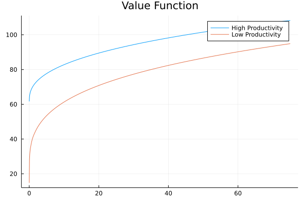
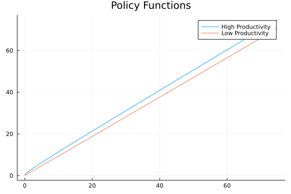
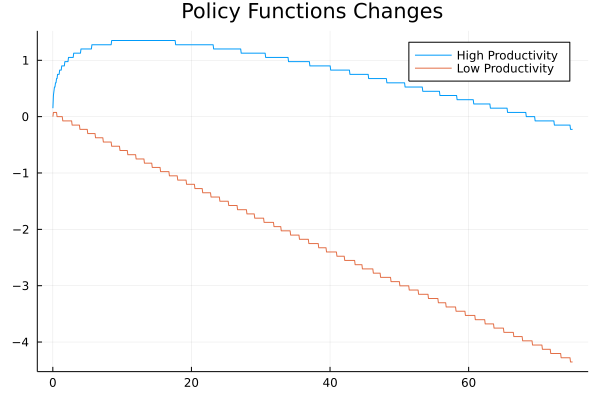
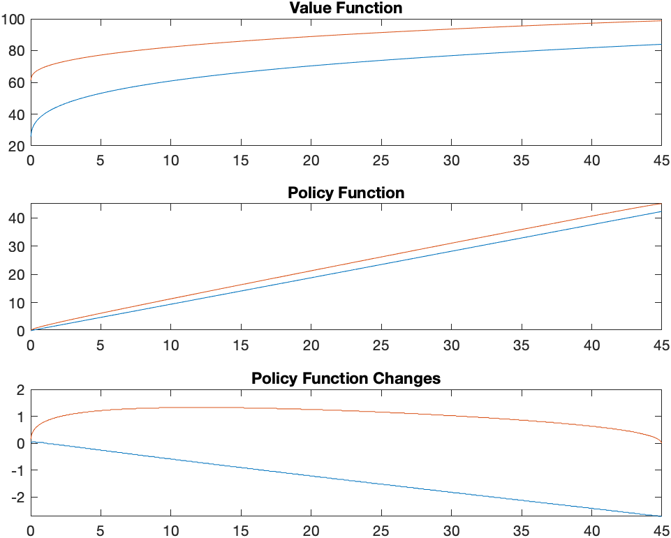

```{r setup, include=FALSE}
knitr::opts_chunk$set(echo = TRUE)
library(tidyverse)
library(knitr)
library(gridExtra)
```

Assume that households have log preferences, the production technology satisfies $Y_t = Z_t K_t^{\theta}$ where $\theta = 0.36$; and capital depreciates at rate $\delta = 0.025$. We will assume technology shocks follow a 2 state Markov Process. The transition matrix is calibrated to NBER business cycle data where we take an expansion to be an instance of a positive technology shock and recession to be an instance of a negative technology shock. The transition matrix is given by

$$
\Pi = 
\begin{bmatrix} 
0.977 & 0.023 \\ 0.074 & 0.926 \end{bmatrix}
$$

where, for instance, $Pr(Z_{t+1} = Z^g| Z_t = Z^g) = 0.977$.

You must expand the state space to add technology shocks from the set $\zeta = \{Z^g = 1.25; Z^b = 0.2\}$. Notice that these values satisfy that $\bar{Z} = 1$: To see this, note that $\Pi$ implies an invariant distribution over the two states of $\bar{p}^g = 0.763$ and $\bar{p}^b = 0.237$. In that case, set $Z^g = 1.25$ and solved for $Z^b$ in $\bar{Z} = \bar{p}^g Z^g + \bar{p}^b Z^b$.

1. State the dynamic programming problem.

The sequence formulation of the planners problem is:

$$
\max_{(C_t, K_{t+1})_{t=1}^\infty} E_0 \sum_{t=0} \beta^t \log(C_t)
$$

$$
\text{s.t. } C_t + K_{t+1} = Z_t K_t^\theta +  (1 - \delta) K_t
$$

The dynamic programming problem is:

$$
V(K, Z) = \max_{C, K'} \{ \log(C) + \beta E[V(K', Z') | Z]\}
$$

$$
\text{s.t. } C + K' = ZK^\theta +  (1 - \delta) K
$$

$$
\implies
V(K, Z) = \max_{K'} \{ \log(ZK^\theta +  (1 - \delta) K - K') + \beta E[V(K', Z') | Z]\}
$$

\pagebreak

2. Plot the value function over $K$ for each state $Z$. Is it increasing (i.e. is $V (K_{i+1}, Z) \ge V (K_i, Z)$ for $K_{i+1} > K_i$)? Is it “concave” (in the sense that $V (K_{i+1}, Z) - V (K_i, Z)$ is decreasing)?

```{r part2, echo = FALSE}

```

The value function is increasing and concave.

\pagebreak

3. Is the decision rule increasing in $K$ and $Z$ (i.e. is $K'(K_{i+1}, Z) \ge K' (K_i, Z)$ for $K_{i+1} > K_i$ and is $K'(K, Z^g) \ge K'(K, Z^b))$? Is saving increasing in $K$ and $Z$ (to see this, plot the change in the decision rule $K'(K, Z) - K$ across $K$ for each possible exogenous state $Z$)?

```{r part3a, echo = FALSE}

```

The decision rule is increasing in $K$ and $Z$.

```{r part3b, echo = FALSE}

```

Savings are increasing $Z$. For $Z^g$, savings are increasing in $K$ for small $K$ and then decreasing. And for $Z^b$, savings are decreasing for all levels of $K$.

\pagebreak

## Matlab Figures

```{r matlab_figures, echo = FALSE}

```

\pagebreak

## Fortran Figures

```{r fortran_figures, echo = FALSE}

data <- read_csv("fortran_output.csv", 
                 col_names = c("k", "value_function_low", "value_function_high", "g_k_low", "g_k_high"),
                 col_types = "ddddd") %>%
  pivot_longer(cols = -"k") 

p1 <- data %>%
  filter(name %in% c("value_function_low", "value_function_high")) %>%
  ggplot() + 
  geom_line(aes(x=k, y=value, color = name)) + 
  ggtitle("Value Function") + 
  theme(legend.position = "none")

p2 <- data %>%
  filter(name %in% c("g_k_low", "g_k_high")) %>%
  ggplot() + 
  geom_line(aes(x=k, y=value, color = name)) + 
  ggtitle("Policy Function") + 
  theme(legend.position = "none")

p3 <- data %>%
  filter(name %in% c("g_k_low", "g_k_high")) %>%
  mutate(value = value - k) %>%
  ggplot() + 
  geom_line(aes(x=k, y=value, color = name)) + 
  ggtitle("Policy Function Changes") + 
  theme(legend.position = "none")

grid.arrange(p1, p2, p3, nrow = 3)

```

