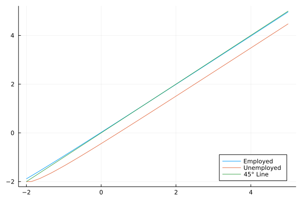
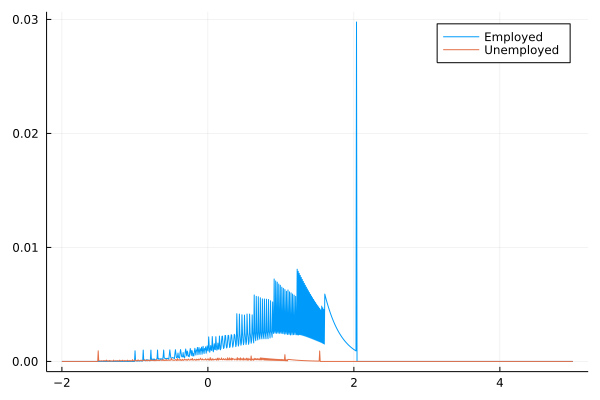
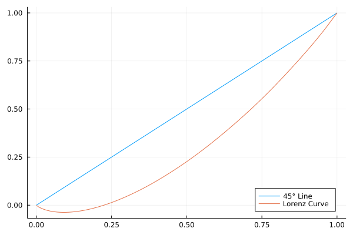
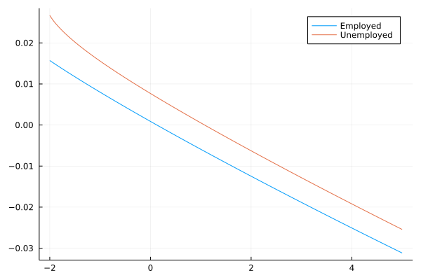

```{r setup, include=FALSE}
knitr::opts_chunk$set(echo = TRUE)
library(tidyverse)
library(knitr)
library(gridExtra)
```

### Part I

Consider the same environment as Huggett (1993, JEDC) except assume that there are enforceable insurance markets regarding the idiosyncratic shocks to earnings and that there are no initial asset holdings. Solve for a competitive equilibrium. What are prices? What is the allocation?

The enforceable insurance markets regarding the idiosyncratic shocks to earnings implies that markets are complete, so the first and second welfare theorems hold.  Thus, we can solve the planners problem and solve for the implied price.  

The markov transition matrix described in Part II implies a stationary measure $\pi_e$ of employed agents and $\pi_u = 1 - \pi_e$ of unemployed agents in each period $t$.  Thus the resource constraint is:

$$
\pi_e c_{e, t} +\pi_u c_{u, t} \le \pi_e e + \pi_u u
$$

for all $t$ where $c_{e, t}$ is the consumption of the employed agents and $c_{u, t}$ is the consumption of the unemployed agents. The resource constraint holds with equality. Thus, the utilitarian planners problem is:

$$
\max_{\{(c_{e, t}, c_{u, t})\}_{t=0}^\infty} \sum_{t=0}^\infty \beta^t [ \pi_e u(c_{e, t}) + \pi_u u (c_{u, t})]
$$

$$
\text{s.t. } \pi_e c_{e, t} +\pi_u c_{u, t} = \pi_e e + \pi_u u \; \forall t
$$

$$
\implies 
\max_{c_{e, t}} \sum_{t=0}^\infty \beta^t \Bigg[\pi_e u(c_{e, t}) + \pi_u u\Bigg( \frac{\pi_e}{\pi_u} e + u - \frac{\pi_e}{\pi_u} c_{e, t}\Bigg)\Bigg]
$$

FOC [$c_{e, t}$]:

$$
\pi_e u'(c_{e, t}) = \pi_u u'( c_{u, t})\frac{\pi_e}{\pi_u} 
\implies 
c_{e, t} = c_{u, t} = c^{FB} = \pi_e e +\pi_u u
$$

Using the parameters described in Part II:

$$
c^{FB} = 0.94 \times 1 + 0.06 \times 0.5 = 0.97
$$

Finally, market clearing implies that bond prices $q_t = q^{FB} = 1$.

\pagebreak

### Part II

Now compute Huggett (1993, JEDC) with incomplete markets. The following takes you through the steps of solving a simple general equilibrium model that generates an endogenous steady state wealth distribution. 

The algorithm is to: 

(1) Taking a price of discount bonds $q \in [0, 1]$ as given, solve the agent’s dynamic programming problem for her decision rule $a' = g_{\theta}(a, s; q)$ where $a \in A$ are asset holdings, $s \in S \subset \R_{++}$ is exogenous earnings, and $\theta$ is a parameter vector. Define the operator $T$ on the space of bounded functions on $A \times S$ (bounded by virtue of the fact that $A\times S$ is compact) by

$$
(Tv)(a, s; q) = \max_{(c, a') \in \Gamma(a, s; q)} \frac{c^{1-\alpha} - 1}{1 - \alpha} + \beta \sum_{s' \in S} \Pi(s'|s) v(a', s'; q)
$$

> where

$$
\Gamma(a, s; q) = \{(c, a') \in \R_+ \times A : c + qa' \le s +a \}.
$$

> Starting with a guess for $v(a, s; q)$, call it $v^0$, use operator $T$ to define mappings $T^n$ where $v^n = T^nv^0$ until

$$
\sup_a \Bigg| \frac{T^{n+1}v^0 - T^n v^0}{T^n v^0} \Bigg| < \varepsilon
$$

> for all $s$ for arbitrary small $\varepsilon$.

(2) Given the decision rule and stochastic process for earnings, solve for the invariant wealth distribution $\mu^*(A, S; q)$. Given the decision rule $g_q$ from step 1, define the operator $T^*$ on the space of probability measures $\Lambda(\tilde{A} \times S)$ by 

$$
(T^* \mu)(\tilde{A}_0, S_0) = 
\sum_{(a', s') \in \tilde{A}_0 \times S_0} 
\Bigg\{ 
\sum_{(a', s') \in \tilde{A} \times S} 
\chi_{\{a' = g_q(a, s)\}}
\Pi(s'|s)
\mu(a, s; q)
\Bigg\}
$$

> where $\chi_{\{a' = g_q(a, s)\}}$ is a function that indicates $(a, s)$ combinations which map to a given $a'$ and $\tilde{A}_0 \times S_0 \subset \tilde{A} \times S$.  Starting with a guess for $\mu(a, s; q)$, call it $\mu^0$, use the operator $T^*$ to define mappings $T^{*n}$ where $\mu^n = T^{*n} \mu^0$ until

$$
\sup_a \Bigg| \frac{T^{*n+1} \mu^0 - T^{*n} \mu^0}{T^{*n} \mu^0} \Bigg| < \varepsilon
$$

> for all $s$ for arbitrary small $\varepsilon$.

(3) Given $\mu^*$, check whether the asset market clears at $q$ (i.e. $\int_{A, S} g_\theta(a, s; q) \mu^*(da, ds; q) = 0$). If it is, we are done. If not (i.e. it is not within an acceptable tolerance), then bisect $[0, 1]$ in the direction that clears the market.  Embed the functions associated with steps 1 and 2 into a program to calculate excess demand of assets and revise $q'$ until markets clear.

> Let the parameter vector $\theta = (\beta, \alpha, S, \Pi, A)$ be given by:

- The discount factor $\beta = 0.9932$,
- The coefficient of relative risk aversion $\alpha = 1.5$,
- The set of earnings states $S = \{e, u\}$ where $e=1$ and $u=0.5$.
- The markov process for earnings $\Pi(s' = e | s = e) = 0.97$ and $\Pi(s' = u | s = u) = 0.5$.
- The space of asset holdings be given by the compact set $A = [-2, 5]$.

\pagebreak

Plot the policy function $g(a, s)$ over $a$ for each $s$ to verify that there exists $\hat{a}$ where $g(\hat{a}, s) < \hat{a}$. 

```{r, echo = FALSE, out.width = "70%", out.height= "70%"}

```

For $s = e$, $\hat{a} = 1.28$.  For $s = u$, $\hat{a} = -2.00$.

The equilibrium bond price is 0.99425.

Wealth is defined as current earnings plus net assets. Plot the cross-sectional distribution of wealth for those employed and those unemployed on the same graph.

```{r, echo = FALSE, out.width = "70%", out.height= "70%"}

```

\pagebreak

Plot the Lorenz curve.

```{r, echo = FALSE, out.width = "70%", out.height= "70%"}

```

The Gini index is 0.379.

The Gini coefficient of the actual wealth distribution in the U.S. was 0.800 in 1998, 0.816 in 2007 (from Diaz Gimenez, Glover, and Rios-Rull (2011) via Dean's presentation), and 0.852 in 2019 (from the Global Wealth Databook by Credit Suisse).  Thus, our model captures roughly 44 to 48 percent of wealth inequality.

\pagebreak

### Part III

To assess the question about the welfare gains associated with moving from incomplete to complete markets, compute consumption equivalents using the following formulas. In particular, you are to answer the following specific question: what fraction of consumption would a person in a steady state of the incomplete markets environment be willing to pay (if positive) or have to be paid (if negative) in all future periods to achieve the allocation of the complete markets environment?

The welfare associated with complete markets is:

$$
W^{FB} 
= 
\sum_{t=0}^\infty \beta^t \frac{(c^{FB})^{1 - \alpha} - 1}{1 - \alpha}
= 
\frac{(c^{FB})^{1 - \alpha} - 1}{(1 - \alpha)(1-\beta)}
\approx
-4.2526
$$

For each $(a, s)$ we compute $\lambda(a, s)$ such that

\begin{align*}
W^{FB} 
&= E \Bigg[ \sum_{t=0}^\infty \beta^t \frac{[(1 + \lambda(a, s))c_t(a, s)]^{1 - \alpha} - 1}{1 - \alpha} \Bigg|(a, s) \Bigg]\\
&= (1 + \lambda(a, s))^{1-\alpha}E \Bigg[ \sum_{t=0}^\infty \beta^t \frac{c_t(a, s)^{1 - \alpha}}{1 - \alpha}  \Bigg] + \frac{1}{(1 - \alpha)(1 - \beta)}\\
&= (1 + \lambda(a, s))^{1-\alpha}\Bigg[ v(a, s) + \frac{1}{(1 - \alpha)(1 - \beta)}  \Bigg] + \frac{1}{(1 - \alpha)(1 - \beta)}
\end{align*}

$$
\implies 
\lambda(a, s) = \Bigg[ \frac{W^{FB} + \frac{1}{(1- \alpha)(1-\beta)}}{v(a, s) + \frac{1}{(1-\alpha)(1-\beta)}} \Bigg]^{\frac{1}{1-\alpha}} - 1
$$

where $v(a, s)$ is the value function from the incomplete markets economy.  Plot $\lambda(a, s)$ across $a$ for both $s = e$ and $s = u$ in the same graph.

```{r, echo = FALSE, out.width = "70%", out.height= "70%"}

```

The welfare associated with incomplete markets is 

$$
W^{INC} = \sum_{(a, s) \in A \times S} \mu(a, s) v(a, s) \approx -4.4539
$$
The economywide welfare gain is:

$$
WG = \sum_{(a, s) \in A \times S} \lambda(a, s) \mu(a, s) \approx 0.001357
$$

The fraction of the population would favor changing to complete markets? 

$$
\sum_{(a, s) \in A \times S} \one_{\{\lambda(a, s) \ge 0\}}(a, s) \mu(a, s) \approx 0.541
$$

