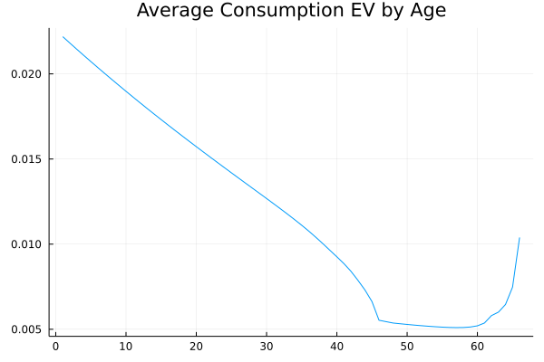
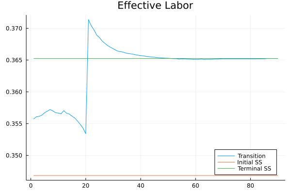
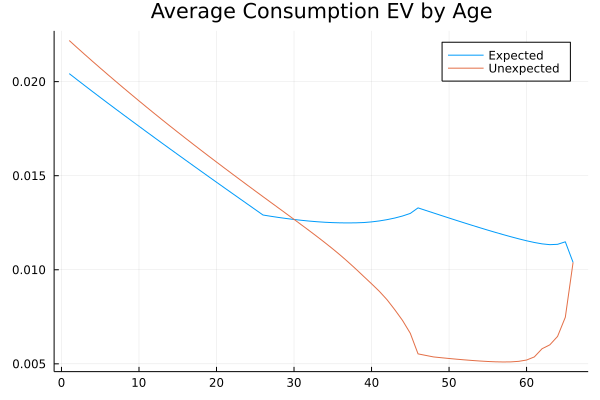

```{r setup, include=FALSE}
knitr::opts_chunk$set(echo = TRUE)
library(tidyverse)
library(knitr)
```

# Exercise 1

1. Use the parameterization from the previous problem set. We continue to assume that labor supply is endogenous. Solve for the stationary equilibrium with social security ($\theta^{SS}_0 = 0.11$) and without it ($\theta^SS_N = 0$) following the algorithm described in the lecture notes (*Step 1: Calculating the stationary competitive equilibrium*). Denote the initial distribution of agents over age, $j$, asset holdings, $a$, and productivity levels, $z$, by $\Gamma_0^{SS} ( z, a, j; \theta_0^{SS})$. Denote the welfare of agents alive in the initial steady state by $V_0^{SS}(z, a, j; \theta_0^{SS})$.

```{r echo = FALSE}
df <- read_csv("tables/table_ss.csv", col_types = cols()) %>% t()

colnames(df) <- paste0("(", 1:2, ")")

kable(df, digits = 3, caption = "Steady State Comparison")
```

The steady state comparison largely matches that of problem set  (I have altered the asset grid end points and increment to improve runtime, so it's not a perfect match to problem set 3).  Column (1) is the steady state with social security and column (2) is the steady state without social security.  Aggregate capital is higher without social security because agents need to save more for retirement.  Aggregate labor is also higher without social security due to the lack of the distortionary labor tax.  Wages are higher, but the interest rate is lower.  Finally, aggregate welfare is higher with social security than without it and the coefficient of variation of wealth is lower with social security.

\pagebreak

2.  Compute the transition path of the economy using the algorithm in *Step 2: Solving for the transition path* in the lecture notes. Try $N = 30$ for the number of periods it approximately takes to get to the new steady state. Obtain and store the value function for the generations in the initial steady state, $V_0(z, a, j; \theta_0^{SS}, \theta_N^{SS})$. Plot the transition paths of interest rate, wage, capital, and effective labor. Comment on the results you obtain.

{width=300px} {width=300px}

{width=300px} {width=300px}

I originally tried $N = 30$, but the transition path was not close enough on the terminal steady state, so I reran it with $N = 50$ and then $N = 70$.

Upon impact, people start working a lot more because they find out that they are not going to receive social security benefits.  This pushes effective aggregate labor even higher than the new terminal steady state value.  This increase in labor pushes interest rates up and wages down. With higher interest rates, people save more and with lower wages, people work less.  Thus, aggregate capital converges to the new steady state from below and aggregate labor converges to the new steady state from above.

\pagebreak

3. What fraction of the overall population would support the reform? Compute and plot the measure of consumption equivalent variation for each age, $EV_j$, using

$$
EV_j = \sum_z \int_a EV(z, a, j) \Gamma_0^{SS}(z, a, j; \theta_0^{SS})da
$$

> with

$$
EV(z, a, j) = \Bigg(\frac{V_0(z, a, j; \theta_0^{SS}, \theta_N^{SS})}{V_0(z, a, j; \theta_0^{SS})}\Bigg)^{\frac{1}{\gamma(1-\sigma)}}
$$

> Discuss the results.

{width=600px}

The consumption equivalent variation measures by how much (in percent) an individual’s consumption has to be increased in all future periods and contingencies (keeping leisure constant) in the initial steady state, so that her expected future utility equals that under the reform.  Thus, if $EV \ge 1.0$, the agent would vote for the reform; she would vote against the reform otherwise.  The figure shows that the average agent at all ages have EV below 1.0, so they would vote against the reform.  The overall vote share would be 16.8 percent.

\pagebreak

## Exercise 2

1. Instead of considering an unexpected elimination of the social security system, assume that in $t = 0$ the government credibly announces that it is going to abolish the public pension system starting from $t = 21$ onwards. Thus, all individuals retired keep their social security benefits, but future retirees anticipate that they will receive only part or no social security beneits. Repeat steps (1)-(3) of exercise 1 to study how agents readjust their plans and how political support changes for the anticipated reform in 21 years. You will have to increase the number of transition periods (try $N = 50$). Discuss your results.

{width=300px} {width=300px}

{width=300px} {width=300px}

{width=300px} {width=300px}

\pagebreak

This transition path takes about 90 periods to converge.  Theta is 0.11 for the first twenty periods and then drops to zero.  At the announcement date, people start to work more because they now need to save for retirement.  The jump in aggregate labor is smaller than MIT shock case both because older workers will receive at least part of their social security benefits and the distortionary labor tax is still is place.  Because aggregate labor increased, social security benefits and interest rates jump up and wages jump down. With the higher interest rates, people start to save more.  Over the next twenty periods, higher savings push interest rates down and wages (and thus social security benefits) up. At $N=21$, the distortionary tax is removed (theta and benefits to zero), so aggregate labor jumps above the terminal steady state value.  Wages and interest rates correspondingly jump down and up, respectively.  Over the next periods, aggregate capital converges to the new steady state level from below and aggregate labor converges to the new steady state level from above. 

{width=600px}

Looking at the consumption equivalent variation, we see that the expected reform improves the situation for older workers and retired agents and makes the situation a little worse for young workers.  Retirees are much better off because they still get full social security benefits. Workers over model age 25 partial social security benefits.  Younger workers still have to pay social security taxes, but never receive any benefit, so they are worse off.  The share of agents with $EV \ge 1.0$ is 23.2 percent.  So this reform is more popular than unexpectedly removing social security.