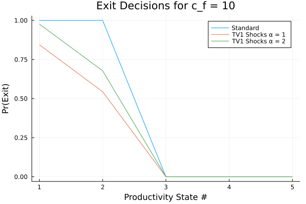

```{r setup, include=FALSE}
knitr::opts_chunk$set(echo = TRUE)
library(tidyverse)
library(knitr)
```

I compute standard Hopenhayn and Rogerson (1993) model as well as this model with TV1 shocks following the description laid out in the problem set.  

For $c_f = 10$, the table shows my results:

```{r echo = FALSE}
summary <- read_csv("tables/summary.csv", col_types = cols()) 

summary %>%
  filter(c_f == 10) %>%
  select(-c_f, -alpha) %>%
  t() %>%
  kable(col.names = c("Standard", "TV1 alpha = 1", "TV1 alpha = 2"),
        digits = 2) 
```

Explanation ...

\pagebreak

{width=600px}

Explanation ...

Increasing $c_f = 15$, ...

```{r echo = FALSE}
summary %>%
  filter(c_f == 15) %>%
  select(-c_f) %>%
  t() %>%
  kable(col.names = c("Standard", "TV1 alpha = 1", "TV1 alpha = 2"),
        digits = 2) 
```

Explanation ...

{width=600px}

Explanation ...

\pagebreak

# Appendix - Static Labor Demand

$$
\pi(s; p) = \max_{n \ge 0} psn^\theta - n - pc_f
$$

FOC [$n$]:

$$
\theta p s n^{\theta - 1} = 1 \implies n^* = (p s \theta)^{\frac{1}{1 - \theta}}
$$

# Appendix - Static Labor Supply

The HH problem:

$$
\max_{C, N^s} \ln(C) - AN^s \text{ s.t. } pC \le N^s + \Pi
$$


$$
\implies \max_{N^s} \ln \Bigg( \frac{N^s + \Pi}{p} \Bigg) - AN^s
$$

FOC [$N^s$]:

$$
\frac{p}{N^s + \Pi}\frac{1}{p} = A \implies N^s = \frac{1}{A} - \Pi
$$

$$
\implies C = \frac{(\frac{1}{A} - \Pi) + \Pi}{p} = \frac{1}{Ap}
$$

\pagebreak

# Appendix - Steady State Firm Distribution

In this appendix, I find $\boldsymbol{\mu^*} = \begin{pmatrix} \mu^*(s_1) \\ \vdots \\ \mu^*(s_5) \end{pmatrix}$ explicitly in term of exit decision rules $X$, transition function $F$, and stationary distribution $\nu$.  From the problem set,

$$
\mu^*(s') = \sum_{s} [1 - X(s)] F(s, s') \mu^*(s) + M \sum_s [1 - X(s)] F(s, s') \nu (s) 
$$

Stacking the five equations on top of each:

\begin{align*}
\begin{pmatrix} \mu^*(s_1) \\ \vdots \\ \mu^*(s_5) \end{pmatrix} 
&= 
\begin{pmatrix} \sum_{s} [1 - X(s)] F(s, s_1) \mu^*(s) \\ \vdots \\ \sum_{s} [1 - X(s)] F(s, s_5) \mu^*(s) \end{pmatrix} 
+ M 
\begin{pmatrix} \sum_s [1 - X(s)] F(s, s_1) \nu (s) \\ \vdots \\ \sum_s [1 - X(s)] F(s, s_5) \nu (s) \end{pmatrix} \\
\implies
\begin{pmatrix} \mu^*(s_1) \\ \vdots \\ \mu^*(s_5) \end{pmatrix} 
&= 
\begin{pmatrix} 
[1 - X(s_1)] F(s_1, s_1) &...& [1 - X(s_5)] F(s_5, s_1) \\ 
\vdots && \vdots \\ 
[1 - X(s_1)] F(s_1, s_5) &...& [1 - X(s_5)] F(s_5, s_5) \end{pmatrix} 
\begin{pmatrix} \mu^*(s_1) \\ \vdots \\ \mu^*(s_5) \end{pmatrix}
\\
&+ M 
\begin{pmatrix} 
[1 - X(s_1)] F(s_1, s_1) &...& [1 - X(s_5)] F(s_5, s_1) \\ 
\vdots && \vdots \\ 
[1 - X(s_1)] F(s_1, s_5) &...& [1 - X(s_5)] F(s_5, s_5) \end{pmatrix} 
\begin{pmatrix} \nu(s_1) \\ \vdots \\ \nu(s_5) \end{pmatrix}\\
\implies
\boldsymbol{\mu^*} &= Z \boldsymbol{\mu^*} + M Z \boldsymbol{\nu}  \\
\implies
\boldsymbol{\mu^*} &= M (I - Z)^{-1}Z \boldsymbol{\nu}  
\end{align*}

where

$$
Z = 
\begin{pmatrix} 
[1 - X(s_1)] F(s_1, s_1) &...& [1 - X(s_5)] F(s_5, s_1) \\ 
\vdots && \vdots \\ 
[1 - X(s_1)] F(s_1, s_5) &...& [1 - X(s_5)] F(s_5, s_5)
\end{pmatrix}
=
\begin{pmatrix} 
[1 - X(s_1)] &...& [1 - X(s_1)] \\ 
\vdots && \vdots \\ 
[1 - X(s_5)] &...& [1 - X(s_5)]
\end{pmatrix}'
.\times
F'
$$

