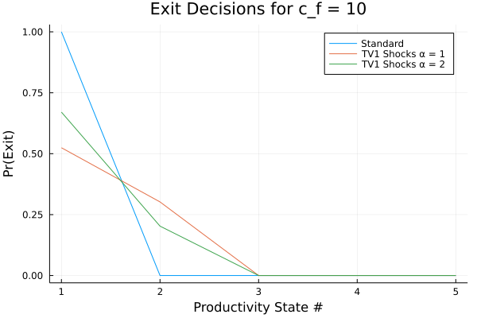

```{r setup, include=FALSE}
knitr::opts_chunk$set(echo = TRUE)
library(tidyverse)
library(knitr)
```

In this problem set, I compute the Hopenhayn and Rogerson (1993) model as described in the problem set assignment.  I compute both the standard version as well as the model with TV1 shocks.  

Table 1 shows the results for $c_f = 10$ and the first figure shows the corresponding exit decisions. 

- In the standard model, the lowest productivity firms exit and all other firms do not exit (first figure).  Adding the TV1 shocks, results in interior probabilities of exit based on productivity, with the less productive firms being more likely to exit. As we increase $\alpha$ from 1 to 2, we decrease the variance of the TV1 shocks, so we see that the least productivity firms are more likely to exit.

- The price drops from the standard model to the models with TV1 shocks.  Price is pinned down by the entry condition. Adding the TV1 shocks, slightly increase the franchise value ($W$ in the problem set) of low productivity firms, but more substantially decrease the franchise value of the high productivity firms. On net, the expected franchise value for a potential entrant is lower ($W \cdot \nu$).  Thus, the price needs to drop in the TV1 model to satisfy the entry condition.

- With the lower price, the optimal labor demand at each price level is lower with TV1 shocks.

- The mass of entrant increases with TV1 shocks.  The mass of entrants is pinned down by the labor market clearing condition. With lower prices with TV1 shocks, firms are smaller so more there is more entrants.  The mass of incumbents is higher with TV1 shocks because the mass of incumbents is increasing in the mass of entrants.

- Similarly the mass of exits is higher with a higher mass of incumbents. With more firms, aggregate labor is higher with TV1 shocks.  And since entrants are larger relative to incumbents, the fraction of the labor hired by entrant firms is higher.

- Most of the results with TV1 shocks $\alpha = 2$ sit between the results of the standard model and that with the TV1 shocks $\alpha = 1$.  This makes sense, the higher the $\alpha$, the lower the variance of the TV1 shocks, the "closer" the model is to the standard model.

```{r echo = FALSE}
summary <- read_csv("tables/summary.csv", col_types = cols()) 

summary %>%
  filter(c_f == 10) %>%
  select(-c_f, -alpha) %>%
  t() %>%
  kable(col.names = c("Standard", "TV1 alpha = 1", "TV1 alpha = 2"),
        digits = 2,
        caption = "Results for c_f = 10") 
```

\pagebreak

{width=600px}

Table 2 shows the results for $c_f = 15$ and the second figure shows the corresponding exit decisions. 

- We see that with a higher fixed cost, both the lowest and second lowest productivity firms exit in the standard model.  The TV1 shocks make exit decisions with probability decreasing in productivity. The higher the $\alpha$ the "closer" the model is the standard model.

- With the higher fixed cost, the market is dominated by fewer, larger firms.  This makes sense; with higher fixed costs it is more difficult for smaller, less productive firms to compete.

- Thus, prices are higher and the mass of incumbents and exits is much smaller.

- The mass of entrants is larger because the expected franchise value is higher. I.e., there is the incentive to gamble on becoming a high productivity firm, which is very profitable with the smaller market.

- With fewer, larger firms, aggregate profit is higher, so aggregate labor supply is higher.  Thus, aggregate labor about the same between the levels of fixed costs.

```{r echo = FALSE}
summary %>%
  filter(c_f == 15) %>%
  select(-c_f, -alpha) %>%
  t() %>%
  kable(col.names = c("Standard", "TV1 alpha = 1", "TV1 alpha = 2"),
        digits = 2,
        caption = "Results for c_f = 15") 
```


{width=600px}

\pagebreak

# Appendix - Static Labor Demand

$$
\pi(s; p) = \max_{n \ge 0} psn^\theta - n - pc_f
$$

FOC [$n$]:

$$
\theta p s n^{\theta - 1} = 1 \implies n^* = (p s \theta)^{\frac{1}{1 - \theta}}
$$

# Appendix - Static Labor Supply

The HH problem:

$$
\max_{C, N^s} \ln(C) - AN^s \text{ s.t. } pC \le N^s + \Pi
$$


$$
\implies \max_{N^s} \ln \Bigg( \frac{N^s + \Pi}{p} \Bigg) - AN^s
$$

FOC [$N^s$]:

$$
\frac{p}{N^s + \Pi}\frac{1}{p} = A \implies N^s = \frac{1}{A} - \Pi
$$

$$
\implies C = \frac{(\frac{1}{A} - \Pi) + \Pi}{p} = \frac{1}{Ap}
$$

\pagebreak

# Appendix - Steady State Firm Distribution

In this appendix, I find $\boldsymbol{\mu^*} = \begin{pmatrix} \mu^*(s_1) \\ \vdots \\ \mu^*(s_5) \end{pmatrix}$ explicitly in term of exit decision rules $X$, transition function $F$, and stationary distribution $\nu$.  From the problem set,

$$
\mu^*(s') = \sum_{s} [1 - X(s)] F(s, s') \mu^*(s) + M \sum_s [1 - X(s)] F(s, s') \nu (s) 
$$

Stacking the five equations on top of each:

\begin{align*}
\begin{pmatrix} \mu^*(s_1) \\ \vdots \\ \mu^*(s_5) \end{pmatrix} 
&= 
\begin{pmatrix} \sum_{s} [1 - X(s)] F(s, s_1) \mu^*(s) \\ \vdots \\ \sum_{s} [1 - X(s)] F(s, s_5) \mu^*(s) \end{pmatrix} 
+ M 
\begin{pmatrix} \sum_s [1 - X(s)] F(s, s_1) \nu (s) \\ \vdots \\ \sum_s [1 - X(s)] F(s, s_5) \nu (s) \end{pmatrix} \\
\implies
\begin{pmatrix} \mu^*(s_1) \\ \vdots \\ \mu^*(s_5) \end{pmatrix} 
&= 
\begin{pmatrix} 
[1 - X(s_1)] F(s_1, s_1) &...& [1 - X(s_5)] F(s_5, s_1) \\ 
\vdots && \vdots \\ 
[1 - X(s_1)] F(s_1, s_5) &...& [1 - X(s_5)] F(s_5, s_5) \end{pmatrix} 
\begin{pmatrix} \mu^*(s_1) \\ \vdots \\ \mu^*(s_5) \end{pmatrix}
\\
&+ M 
\begin{pmatrix} 
[1 - X(s_1)] F(s_1, s_1) &...& [1 - X(s_5)] F(s_5, s_1) \\ 
\vdots && \vdots \\ 
[1 - X(s_1)] F(s_1, s_5) &...& [1 - X(s_5)] F(s_5, s_5) \end{pmatrix} 
\begin{pmatrix} \nu(s_1) \\ \vdots \\ \nu(s_5) \end{pmatrix}\\
\implies
\boldsymbol{\mu^*} &= Z \boldsymbol{\mu^*} + M Z \boldsymbol{\nu}  \\
\implies
\boldsymbol{\mu^*} &= M (I - Z)^{-1}Z \boldsymbol{\nu}  
\end{align*}

where

$$
Z = 
\begin{pmatrix} 
[1 - X(s_1)] F(s_1, s_1) &...& [1 - X(s_5)] F(s_5, s_1) \\ 
\vdots && \vdots \\ 
[1 - X(s_1)] F(s_1, s_5) &...& [1 - X(s_5)] F(s_5, s_5)
\end{pmatrix}
=
\begin{pmatrix} 
[1 - X(s_1)] &...& [1 - X(s_1)] \\ 
\vdots && \vdots \\ 
[1 - X(s_5)] &...& [1 - X(s_5)]
\end{pmatrix}'
.\times
F'
$$

