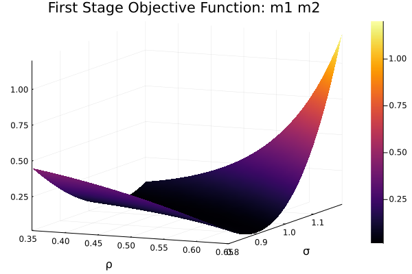

```{r setup, include=FALSE}
knitr::opts_chunk$set(echo = TRUE)
library(tidyverse)
library(knitr)
```


1. \textit{Derive the following asymptotic moments associated with $m_3(x)$: mean, variance, first
order autocorrelation. Furthermore, compute $\nabla_bg(b_0)$. Which moments are informative
for estimating $b$?}

With $|\rho_0| < 1$, the stochastic process $\{x_t\}$ is stationary, so $E[x_t] = E[x_{t-1}]$ and $Var[x_t] = Var[x_{t-1}]$:\footnote{Alternatively, we can write $x_t$ in terms of $x_0$, $\{\varepsilon_i\}_{i=1}^t$, and $\rho_0$:

\begin{align*}
x_t 
&= \rho_0 x_{t-1} + \varepsilon_t \\
&= \rho_0 (\rho_0 x_{t-2} + \varepsilon_{t-1}) + \varepsilon_t \\
&= \rho_0^2 x_{t-2} + \varepsilon_t + \rho_0 \varepsilon_{t-1}  \\
&= \rho_0^2 (\rho_0 x_{t-3} + \varepsilon_{t-2}) + \varepsilon_t + \rho_0 \varepsilon_{t-1}  \\
&= \rho_0^3 x_{t-3} + \varepsilon_t + \rho_0 \varepsilon_{t-1} + \rho_0^2 \varepsilon_{t-2} \\
&= \rho_0^t x_0 + \sum_{i=1}^t \rho_0^{t-i} \varepsilon_i \\
&= \sum_{i=1}^t \rho_0^{t-i} \varepsilon_i
\end{align*}

$$
E[x_t] = E\Bigg[\sum_{i=1}^t \rho_0^{t-i} \varepsilon_i \Bigg] = \sum_{i=1}^t \rho_0^{t-i} E[ \varepsilon_i ] = 0
$$

}

$$
E[x_t] 
= E[\rho_0 x_{t-1} + \varepsilon_t] 
= \rho_0 E[x_{t-1}] 
=\rho_0 E[x_t]
$$

$$
\implies E[x_t] = 0
$$

$$
Var[x_t] = Var[\rho_0 x_{t-1} + \varepsilon_t] = \rho_0^2 Var[x_{t-1}] + \sigma_0^2 = \rho_0^2 Var[x_{t}] + \sigma_0^2 
$$

$$
\implies Var[x_t] = \frac{\sigma_0^2}{1 - \rho_0^2}
$$

$$
Cov[x_t, x_{t-1}] = Cov[\rho_0 x_{t-1} + \varepsilon_t, x_{t-1}] = \rho_0 Cov[x_{t-1}, x_{t-1}] + Cov[\varepsilon_t, x_{t-1}] = \rho_0 Var[x_t] = \frac{\sigma_0^2 \rho_0}{1 - \rho_0^2}
$$

\pagebreak

Thus, the asymptotic moments associated with $m_3(x)$ are:

$$
\mu(x)
=
E[m_3(x)] 
= 
\begin{bmatrix}
0\\
\frac{\sigma_0^2}{1 - \rho_0^2}\\
\frac{\sigma_0^2 \rho_0}{1 - \rho_0^2}
\end{bmatrix}
$$

To calculate the Jacobian, we compute the derivative of the moment conditions with respect to each parameter:

\begin{align*}
\frac{\partial}{\partial \rho}  \Bigg(\frac{\sigma^2}{1 - \rho^2} \Bigg)
&= \frac{\sigma^2(-2\rho) - (1 - \rho^2)(0)}{(1 - \rho^2)^2} \\
&= \frac{-2\rho\sigma^2}{(1 - \rho^2)^2}\\
\frac{\partial}{\partial \sigma} \Bigg( \frac{\sigma^2}{1 - \rho^2} \Bigg)
&= \frac{2\sigma}{1 - \rho^2}\\
\frac{\partial}{\partial \rho}\Bigg( \frac{\sigma^2\rho}{1 - \rho^2}\Bigg)
&= \frac{\sigma^2\rho(-2\rho) - (1- \rho^2)\sigma^2}{(1-\rho^2)^2}\\
&= \frac{-\sigma^2(1 + \rho^2 ) }{(1-\rho^2)^2} \\
\frac{\partial}{\partial \sigma} \Bigg(\frac{\sigma^2\rho}{1 - \rho^2}\Bigg)
&= \frac{2\sigma\rho}{1 - \rho^2}
\end{align*}

Each cell of the Jacobian is the negative of the derivative of the moment condition:

$$
\implies
\nabla_bg(b_0)
=
\begin{bmatrix}
0 & 0\\
\frac{2 \rho_0 \sigma_0^2}{(1 - \rho_0^2)^2} & \frac{- 2 \sigma_0}{1 - \rho_0^2}  \\
\frac{\sigma_0^2 (1 + \rho_0^2)}{(1 - \rho_0^2)^2} & \frac{- 2 \sigma_0 \rho_0}{1 - \rho_0^2} 
\end{bmatrix}
$$

Variance and first order autocorrelation are informative for estimating $b$.

\pagebreak

2. \textit{Simulate a series of “true” data of length $T = 200$ using (1). We will use this to compute $M_T (x)$.}

{width=500px}
$$
M_T(x) =
\begin{bmatrix}
 -0.0764 \\
  1.3953 \\
  0.6916
  \end{bmatrix}
$$

3. \textit{Set $H = 10$ and simulate $H$ vectors of length $T = 200$ random variables $e_t$
from $N(0, 1)$. We will use this to compute $M_{T H}(y(b))$. Store these vectors. You will use the same
vector of random variables throughout the entire exercise. Since this exercise requires
you to estimate $\sigma^2$, you want to change the variance of $e_t$ during the estimation. You
can simply use $\sigma e_t$ when the variance is $\sigma^2$.}

4. \textit{We will start by estimating the $\ell = 2$ vector $b$ for the just identified case where $m_2$
uses mean and variance. Given what you found in part (1), do you think there will
be a problem? In general we would not know whether this case would be a
problem, so hopefully the standard error of the estimate of $b$ as well as the J test will
tell us something.}

From part (1), I found that in expectation the mean is zero, so the problem is that the mean is not informative for estimating $b$.

\pagebreak

(a) \textit{Set $W = I$ and graph in three dimensions, the objective function (3) over $\rho \in [0.35, 0.65]$ and $\sigma \in [0.8, 1.2]$. 
Obtain an estimate of $b$ by using $W = I$ in (4) using
fminsearch. Report $\hat{b}_{TH}^1$.}

{width=500px}

$$
\hat{b}_{TH}^1 = 
\begin{bmatrix}
0.5320 \\
1.0115
\end{bmatrix}
$$

(b) \textit{Set $i(T) = 4$. Obtain an estimate of $W^*$. Using $\hat{W^*}_{TH} = \hat{S}^{-1}_{TH}$ in (4), obtain an estimate of $\hat{b}_{TH}^2$. Report $\hat{b}_{TH}^2$.}

...

(c) \textit{To obtain standard errors, compute numerically $\nabla_b g_T (\hat{b}^2_{TH})$ defined in (6). Report
the values of $\nabla_b g_T (\hat{b}^2_{TH})$. Next, obtain the $\ell \times \ell$ variance-covariance matrix of $\hat{b}^2_{TH}$ as in (7). Finally, what are the standard errors defined in (8)? How can we use the
information on $\nabla_b g_T (\hat{b}^2_{TH})$ to think about local identification?}

...

(d) \textit{Since we are in the just identified case, the $J$ test should be zero (on a computer
this may be not be exact). However, given the identification issues in this particular
case where we use mean and variance, the $J$ test may not be zero. Compute the
value of the $J$ test:}

$$
T \frac{H}{1+H} \times J_{TH}(\hat{b}_{TH}^2) \to \chi^2
$$

> \textit{noting that in this just identified case $n - \ell = 0$ degrees of freedom recognizing that
there really is not distribution.}

...

\pagebreak

5. Next we estimating the $\ell = 2$ vector $b$ for the just identified case where $m_2$ uses the
variance and autocorrelation. Given what you found in part (1), do you now think there
will be a problem? If not, hopefully the standard error of the estimate of $b$ as well as
the $J$ test will tell us something. For this case, perform steps (a)-(d) above.

(a)

...

(b)

...

(c)

...

(d)

...

\pagebreak

6. Next, we will consider the overidentified case where $m_3$ uses the mean, variance and
autocorrelation. For this case, perform steps (a)-(d) above.

(a)

...

(b)

...

(c)

...

(d)

...

(e) Bootstrap the the finite sample distribution of the estimators by repeatedly drawing $\varepsilon_t$ and $e_t^h$ from $N(0, 1)$ for $t =1, ..., T$ and $h = 1, ..., H$. Compute $(\hat{b}_{TH}^1, \hat{b}_{TH}^2)$.

...